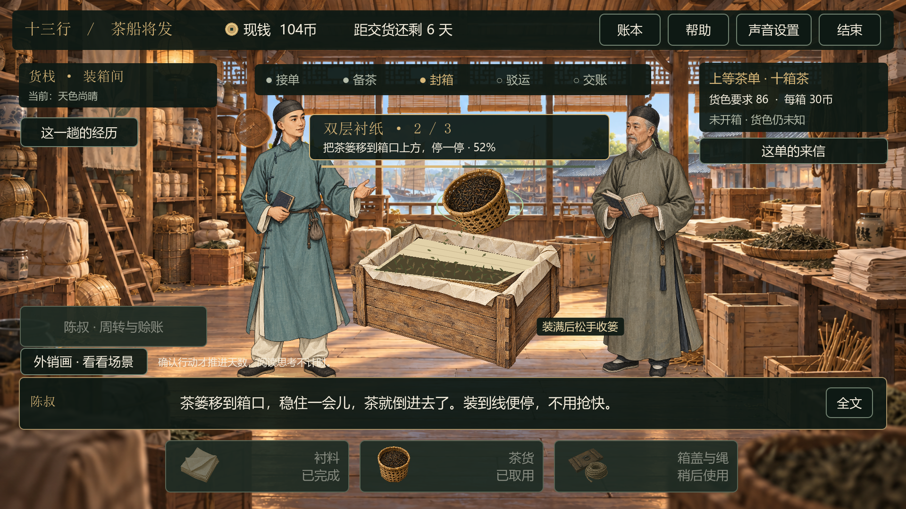
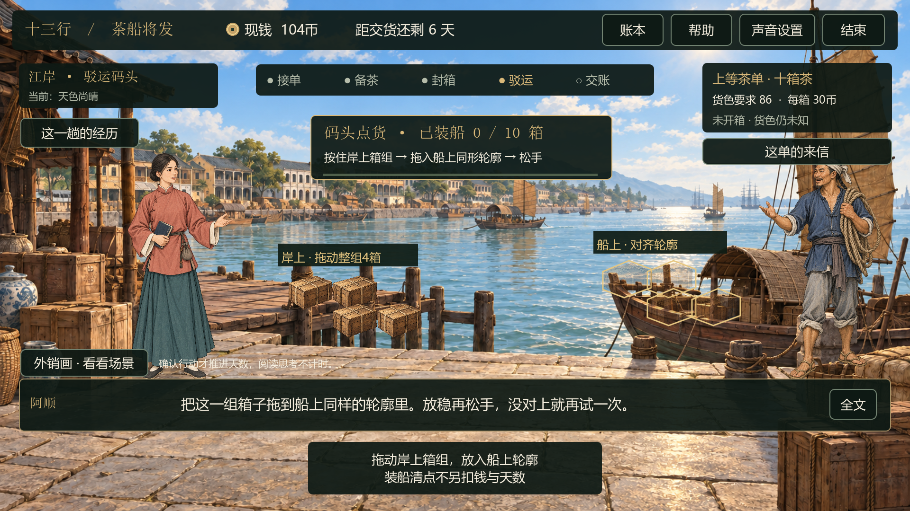
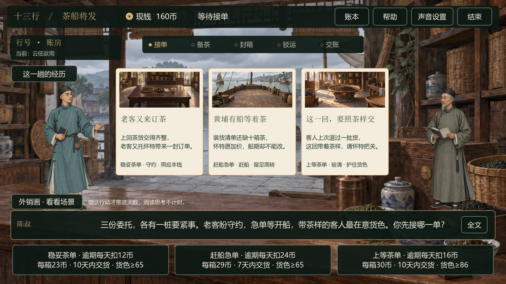
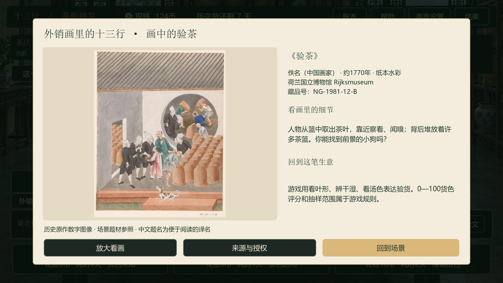
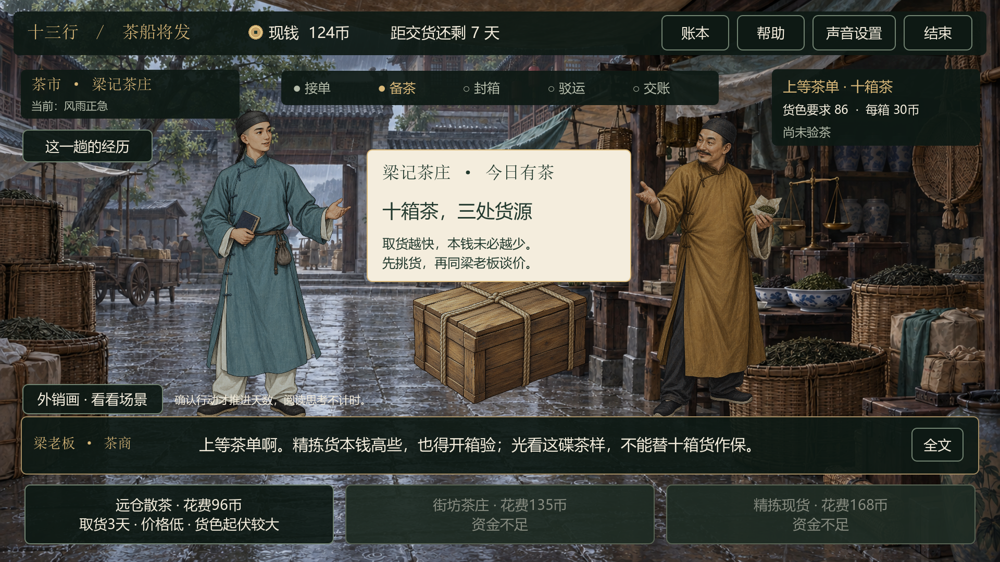
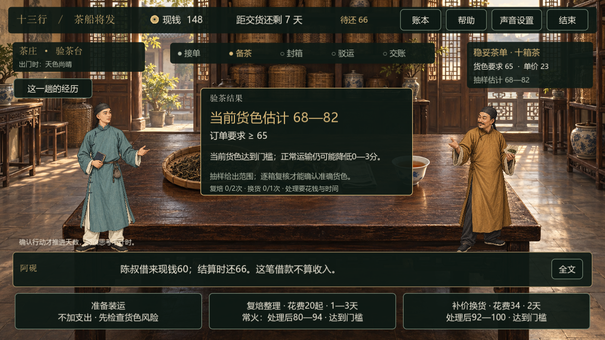
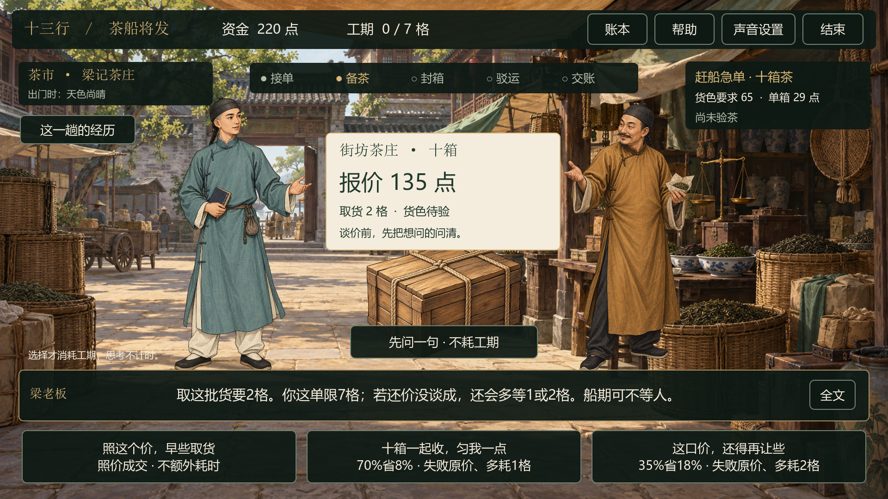
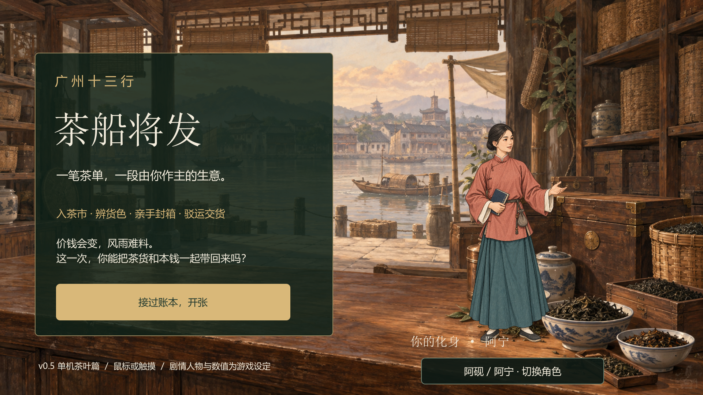
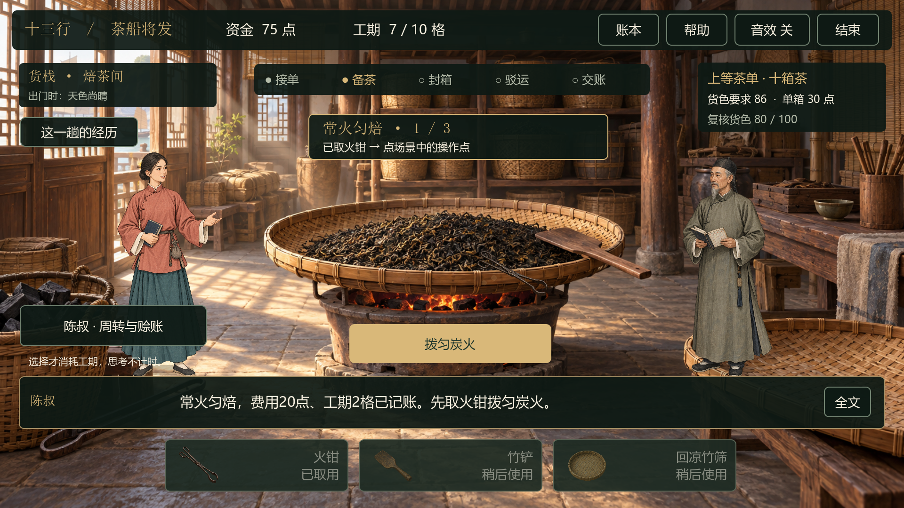
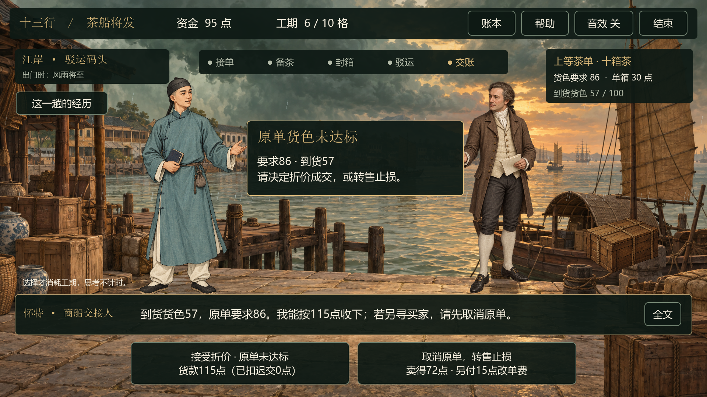

# 十三行 · 茶船将发

**单机茶叶篇 v0.11.1｜Godot 4.7.2｜横屏鼠标／触摸**

**下载即玩：**[最新 Windows 完整包](https://github.com/MyLittleShrimp/13-Hongs-Manager-by-LittleShrimp/releases/latest) · [v0.11.1 更新说明](docs/releases/v0.11.1.md)。在 Release 的 Assets 中下载 `13-Hongs-Manager-v0.11.1-Windows-x64.zip`，包含两首背景音乐、全部场景与原画参考图和便携引擎；解压后双击「启动游戏.cmd」，无需安装 Python 或 Godot。旧版 Windows 触摸设备可用「启动兼容模式.cmd」。

## v0.11.1 封绳更顺手

- 绳头和进度条连续跟随描画，消除按小段跳动的感觉。
- 拐角和手指偏移的判定更宽容，终点附近自动收齐；中途松手可在亮点附近接着画。
- 箱盖木纹复用静态绘制，减少描绳期间的重复计算。
- 保留两道绳分别松手收紧、误操作重试、暂停续画与原有经营规则。详见 [修复与验证](docs/v0.11.1封绳流畅度修复.md)。

## v0.11.0 工序手势与操作衔接

- 补齐摊叶、轻捻、拨火、移筛回凉、铺衬抹平、悬停倒茶和拖盖七个动作。
- 按住工具盘中的道具直接拖到工作区即可操作；也可轻触取用后在附近抓取，无需再点开始。
- 合盖后直接进入现有的描绳动作；原有晃杯、绕盘翻茶和三轮拖箱装船继续保留。
- 有效进度支持暂停后继续，倒茶离开箱口就停，回凉完成才增加货色；重复操作不额外收费或重抽随机结果。
- 两条完整UI交易逐步对照原经营模型通过，含复焙与不复焙路线；继续提供双曲音乐、历史原画、晴雨场景和兼容入口。



规则与验证见 [v0.11工序手势与操作衔接](docs/v0.11工序手势与操作衔接.md)。

## v0.10.0 拖拽与手势互动

- **拖箱上船**：十箱分为4＋3＋3三组，各轮排列不同。按住岸上箱组，拖到船上同形轮廓；轮廓变绿后松手，装妥才计数。
- **轻晃茶杯**：选择「看汤色」，按住茶杯左右轻晃三次，松手后记下观察。
- **绕盘翻茶**：复焙时按住竹铲，沿茶盘绕一圈，顺逆方向均可；翻茶后继续收茶回凉。
- **沿路封绳**：从亮点沿两道绳路描画，绳子随手指路径收紧；中途松手可从亮点接着画。
- 鼠标与原生单指触摸共用规则；拖偏可以重试，操作快慢不改变货色、盈亏或经营随机结果。
- 阅读来信、原画、帮助或切出窗口时暂停；恢复后重新按住继续，避免松手误判与重复记账。



操作方式、技术边界与验证见 [v0.10拖拽与手势互动](docs/v0.10拖拽与手势互动.md)。

## v0.9.0 订单故事与装船演出

- 三份委托各有来由：老客重守约，急单赶船期，上等茶单要照茶样验收。开场、经营对白和结尾相互呼应。
- 接单后可随时打开「这单的来信」；阅读不花钱、不耗天数。
- 封箱表现铺衬、落茶、压盖扎绳；阿顺按4＋3＋3箱点货装船，全部点齐后选择驳运路线。
- 收尾根据实际交期、货色、箱数和盈亏变化。货色达标但迟交、按约交货却亏本、折价和转售都有对应回应。
- 演出期间防重复操作；打开来信或原画暂停，返回继续。沿用原有经营参数和随机结果。



规则、流程和测试见 [v0.9订单故事与装船演出](docs/v0.9订单故事与装船演出.md)。

## v0.8.0 外销画与晴雨场景

- 金额统一补上「币」，例如「花费20币」「谈成可省11币」，对白、货单与账本同步更新。
- 七个场景都有「外销画 · 看看场景」入口，展示4幅真实历史作品，可放大查看，附年代、馆藏和来源。参见 [图像来源与对应范围](docs/外销画参考来源.md)。
- 内置ImageGen新增14张天气背景，七个场景各有晴、阴、风雨三种画面；人物、茶箱、雨丝和天气提示同步变化。
- 天气展示读取已发生的经营事件，不额外抽取随机数；货色、成本、概率和盈亏算法保持一致。





以下旧版本截图与记录保留当时的界面用语。

## v0.7.2 现钱与交货天数

- 金额改用钱币图标与「现钱、花费、实付、待还」等词，去掉资金单位「点」。
- 时间统一按游戏中的「天」显示；顶部显示「距交货还剩7天」「今日须交货」或「已逾期2天」，交货后显示实际用时／逾期天数。
- 订单、议价、验茶、加工、包装、驳运、对白和账本同步调整；阅读与思考不消耗天数。
- 货色仍为0—100评分。帮助说明「金额与天数为游戏设定，贸易流程经过压缩」。成本、概率、期限与盈亏算法保持不变。
- 保留双曲背景音乐与v0.7.1触摸兼容修复。



以下旧版本截图与记录保留当时的界面用语。

## v0.7.1 Windows 触摸兼容修复

- 修复一次触摸附带鼠标事件时，音乐连续开关两次，以及收尾页被点击穿透的问题。
- 音乐关闭同时暂停播放、静音独立音乐总线并归零输出；再次开启恢复原音量和进度。
- 收尾、完成体验及其他按钮统一防重复与转场保护，正常鼠标／触摸操作继续可用。
- 新增兼容启动入口：30帧、Compatibility渲染、较长的重复事件拦截窗口和本地诊断日志。仍为x64包；Snapdragon 860与Windows 10 21390.2025的真实设备回测待完成。

## 游戏介绍

一笔茶单，一段由你作主的生意。《十三行 · 茶船将发》是一款以广州十三行贸易为背景、面向博物馆互动体验设计的二维剧情策略经营游戏。玩家选择阿砚或阿宁，成为行号的新任采购管事，从接下外商茶单开始，体验挑货议价、验茶加工、装箱封绳与江上驳运。货色、成本、船期和随机风雨共同影响最终盈亏；货不达标可以补救，手头紧张可以周转，每次选择都有代价。亲手完成一单茶生意，在人物与场景中感受十三行贸易的协作和经营智慧。

更多版本：[正式介绍与仓库简介](docs/游戏介绍.md)。

## v0.7 验茶结果与工序演出

- 验茶结果在场景中央大字显示货色与订单要求：抽样显示范围，逐箱复核显示准确数值。
- 复焙、换货后保留前后对比，例如「常火匀焙：72 → 84」；未验货时仍显示未知。
- 看叶形、辨干湿、看汤色各有独立观察动作；复焙依次表现拨炭、翻茶和收茶回凉。
- 人物靠近操作台并给出短对白；最后一段回凉播完，再切换到结果画面。
- 工序演出期间防止重复操作；打开帮助暂停动作，回到场景继续，结束本局取消未完成动作。


试玩路线、动作说明与验证见 [v0.7验茶结果与工序演出](docs/v0.7验茶结果与工序演出.md)。

## v0.6 茶市议价深化

- 选定货源后，可以先问梁老板货源、船期和货色；问话可跳过，不消耗资金与工期。
- 用主角的口吻选择照价收货、温和还价或坚持压价，选项按当前报价显示「谈成可省多少点」。
- 成交后留在茶市，观看付款、递单与人物回应，再接过货单前往验茶台。
- 五种成交回应对应真实结果；货单显示实付、让利和等待。验茶、码头与结尾会回扣这次选择。
- 阿砚、阿宁共用全部分支；保留随机货色、真实盈亏、复焙补救和资金应急。



试玩路线、规则与验证见 [v0.6茶市议价深化](docs/v0.6茶市议价深化.md)。

## 背景音乐

- 启动时播放《茶船将发 · Main Theme》（约2分21秒），播完接《茶船将发 · 13 Hongs》（约2分28秒），两首依次循环。
- 选择角色、开始经营、切换场景、再做一单和返回开场均保持播放进度。
- 开场与游戏顶部的「声音设置」可暂停／续播音乐、调节音量，或单独开关点击音效。
- 默认音乐开启、音量35%，点击音效关闭；本次启动内保留设置。音乐文件由用户提供，原始MP3已复制进工程。

## v0.5 男女主角选择

- 在开场右下角人物下方，选择男主角阿砚或女主角阿宁。
- 点击「接过账本，开张」直接用当前角色进入剧情；角色切换入口只保留在开场。
- 人物和对白署名贯穿全部场景；再做一单保留选择，结束本局后可重新选择。
- 两位主角采用相同的经营规则。新增女主角由内置ImageGen生成。



使用方法、素材提示词与验证见 [v0.5角色选择与切换](docs/v0.5角色选择与切换.md)。

## v0.4 场景与剧情深化

- 新增验茶台、焙茶间、货艇内景；总计7个场景、5名角色。
- 验茶先观察叶形、干湿、汤色，再确认结果；抽样与复核保留不同信息精度。
- 复焙先选常火、慢火或快火，再取工具完成操作；费用、工期和提升值提前显示。
- 装箱改为取料、放入、封绳；六件工具配实物图标和取用动画，封妥后再请船家装船。
- 运输结果在船上先显示，损货会在茶箱上表现；交接时由新增的商船交接人出面。
- 增加五段旅程进度、经历回看和七类收尾剧情。
- 单机默认关闭闲置自动复位，可以停下来思考；现场试玩与数字分身接入后置。

本轮规则、火候对比、素材提示词及验证记录见 [v0.4单机场景与剧情深化](docs/v0.4单机场景与剧情深化.md)。新截图与日志在 `artifacts/v0.4/`。

## v0.3 试玩反馈修正

- 货色84低于要求86时，先由玩家选择折价成交或转售止损，履约与盈亏分开显示。
- 复焙最多两次，常火保持72→84→96；每次20点与2格工期，加工后可以继续判断。
- 一次借60还66的周转，以及现在付0、结算扣费的赊箱／赊运；现金归零不会中途终止。
- 清算计入全部成本和借赊义务，最终资金缺口不会被抹去。

详见[货色补救与资金应急](docs/v0.3货色补救与资金应急.md)。v0.3历史证据保留在 `artifacts/v0.3/`。

## 立即试玩

双击本目录的 **「启动游戏.cmd」**。全屏体验用「启动全屏体验.cmd」；编辑工程用「打开Godot工程.cmd」。

**从GitHub首次克隆：**仓库不包含引擎程序。在Windows上使用Python执行以下命令，下载并校验便携Godot、导入素材后，再双击启动脚本：

```powershell
python tools/bootstrap_godot.py
python tools/run_godot.py --headless --editor --import
```

也可以直接用已安装的Godot 4.7.2打开 `prototype/project.godot` 并运行。

- F11 切换全屏，Esc 打开结束提示。
- 鼠标与原生单指触摸均可操作；抬手确认。
- 如果旧游戏窗口还开着，先关闭旧窗口，再启动新版。
- 本地开发目录已备妥便携Godot；GitHub克隆版按上方步骤准备引擎。请保留目录结构。
- 当前是源码运行的可玩原型，尚未打包为正式展陈发行版。
- 当前局不做跨启动存档；关闭程序或主动结束后重新开张。



## 这次已经深化的内容

| 内容 | 当前功能 |
|---|---|
| 场景 | 行号账房、茶市、验茶台、焙茶间、装箱间、码头、货艇；按经营环节切换 |
| 角色 | 可选主角阿砚／阿宁，陈叔、梁老板、阿顺、商船交接人怀特；六张透明全身立绘 |
| 剧情 | 新管事接过第一笔茶单；议价、验茶、风雨应对、盈亏与收尾对白随选择变化 |
| 决策 | 订单、货源、议价、验货、货物处理、三种火候、包装、航线、江上应对、折价／转售与资金应急 |
| 随机经营 | 每局报价、货色、劣批、议价成败、航行事件、损货与到货品质均参与计算；会亏钱 |
| 动作 | 入场移动、待机呼吸、付款递单、三项验茶、拨炭翻茶与回凉、铺衬落茶、封箱搬运、雨丝水纹 |
| 数字分身 | 保留纹理替换接口；生成端与现场联调按用户要求后置 |
| 信息呈现 | 场景占主体，底部短对话和选项；详细账本与知识说明按需打开 |

游戏美术由**内置 ImageGen**生成，原图已复制到工程。目前合计30张PNG：21张背景（7场景×3天气）、6个人物、2个茶箱和1张六件工具图集。另有4张真实历史作品JPEG，独立记录来源。天气提示词在 `art_source/prompts/weather/v0.8-weather.json`，女主角提示词在 `art_source/prompts/player_female_v001.txt`；前版提示词在 `art_source/v0.4-prompts.json`、`art_source/v0.4-tools-prompt.txt`；来源见 `docs/资产台账.md`。

## 一局怎么玩

选择阿砚或阿宁 → 陈叔交代任务 → 选茶单 → 茶市挑货、问话与议价 → 付款接单 → 验茶台观察 → 判断是否进入焙茶间处理 → 选包装并取料封箱 → 到码头选船 → 在货艇上应对随机遭遇 → 靠岸交接与必要的议价 → 回行号看账与分支收尾。

金额用钱币图标及“现钱、花费、收入”等词表示，时间用“天”，顶部提示距交货还有多久。**阅读与思考不消耗天数，确认经营行动才推进时间。**金额与天数为游戏设定，贸易流程经过压缩。提前收的预付款60属于货款的一部分，结算时抵扣；货款不够覆盖预付时会退款。

没有固定的最佳利润，也不按“选对了”发奖励。价钱、货色和运气都会改变结果。预算不足的方案会禁用，可通过周转与赊账继续经营。



以上为引擎实际渲染的测试情境截图；正常启动每局重新随机。

## v0.2 历史验证记录

- 3,000局随机策略：2,321局盈利、664局亏损、15局持平；利润范围 −187 至 +186 点。
- 同一套高风险策略、1,000个种子：742盈、252亏、6持平。
- 经营规则、账本守恒、非法动作和随机状态等检查通过。
- 触摸、双触点、模态遮挡、空闲复位、角色替换和文本边界回归通过。
- 实际 Godot GPU 渲染的完整流程与盈利／亏损截图已保存。

以上是**v0.2历史自动测试结果**。v0.4验证见新版说明，所有样本都不能当作历史经营统计或游客胜率预测。

## 数字分身接入

当前使用虚构角色。已经实现将完整透明人物 PNG 替换进同一个角色节点，继续使用既有剧情、场景位置和动画。

入口：`main.gd → set_player_profile(profile)`，默认样例：`prototype/data/avatar_profile.json`。

拍照、真人形象生成、身份绑定、表情口型和骨骼动画尚未接入。接口与下一阶段计划见 [深化实现说明](docs/v0.2深化实现说明.md)。

## 开发与测试

```powershell
python tools/run_godot.py --headless --script res://tests/test_trade.gd
python tools/run_godot.py --headless --script res://tests/test_workshops.gd
python tools/run_godot.py --headless --script res://tests/test_ui.gd -- --self-test
python tools/run_godot.py --headless --script res://tests/test_characters.gd -- --self-test
python tools/run_godot.py --headless --script res://tests/test_music.gd -- --self-test
python tools/run_godot.py --headless --script res://tests/test_market.gd -- --self-test
python tools/run_godot.py --headless --script res://tests/test_performance.gd -- --self-test
python tools/run_godot.py --headless --script res://tests/test_compatibility.gd -- --self-test --compatibility
python tools/run_godot.py --headless --script res://tests/check_assets.gd
python tools/run_godot.py --resolution 1920x1080 --audio-driver Dummy -- --ui-tour
```

`--ui-tour` 是开发测试，会使用显式的货色和风雨情境覆盖场景与结果分支，截图后自动退出；正常启动每局随机，不使用测试情境。

## 文件

GitHub上传范围与运行准备见 [Git管理说明](docs/GitHub上传准备.md)。下列 `artifacts/`、`archive/`、`tools/godot/`、`runtime-data/` 为本地文件或运行生成目录，默认不提交；仓库内展示截图位于 `docs/images/`。

- `prototype/`：Godot场景、脚本、数据、美术。
- `docs/v0.7验茶结果与工序演出.md`：中央货色结果、验茶与复焙动作及验证。
- `docs/v0.6茶市议价深化.md`：茶市问话、交割、人物反馈与验证。
- `docs/v0.4单机场景与剧情深化.md`：本轮单机功能、工序、火候、结尾和验证。
- `docs/v0.2深化实现说明.md`：玩法、随机规则、数字分身接口和下一阶段。
- `docs/实施进度.md`：当前验证记录与未完成条件。
- `art_source/prompts/`：ImageGen原始提示词。
- `artifacts/v0.7/`：验茶、复焙动作与中央结果的实际画面；旧版证据仍保留。
- `archive/v0.1/`：原文字流程版代码、规则与文档备份。
- `archive/v0.3/`：本轮改动前的代码、规则、测试与文档。
- `tools/godot/`：已校验便携引擎。
- `runtime-data/`：本地运行数据。

## 内容与环境边界

人物、故事、概率、资金和包装操作均为游戏化设定。约1800年为暂定叙事时段，ImageGen场景尚需馆方审定。当前仅完成茶叶篇，瓷器、丝绸、连续多日经营、配音及正式部署待后续。

知识依据：[香港艺术馆·外销艺术](https://hk.art.museum/sc/web/ma/collections/china-trade-art.html)。完整立项分析保留在同目录原计划文件中；实现状态以v0.7文档为准。

启动器仅为子进程设置项目内APPDATA与LOCALAPPDATA，不修改系统全局环境。系统字体不随项目分发；引擎许可见 `LICENSES/`。
