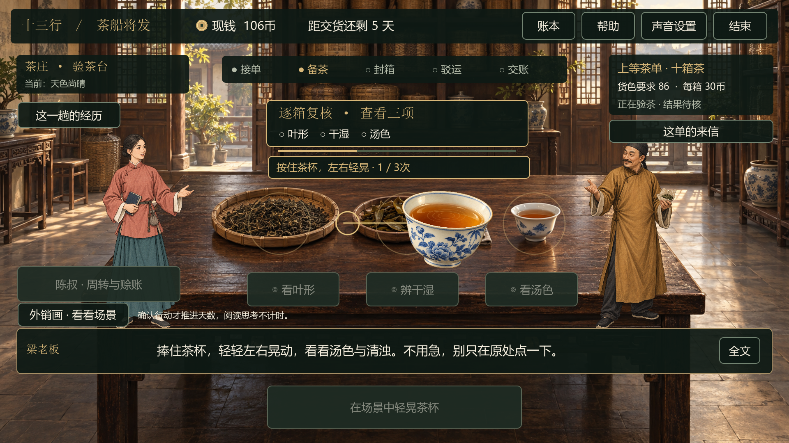
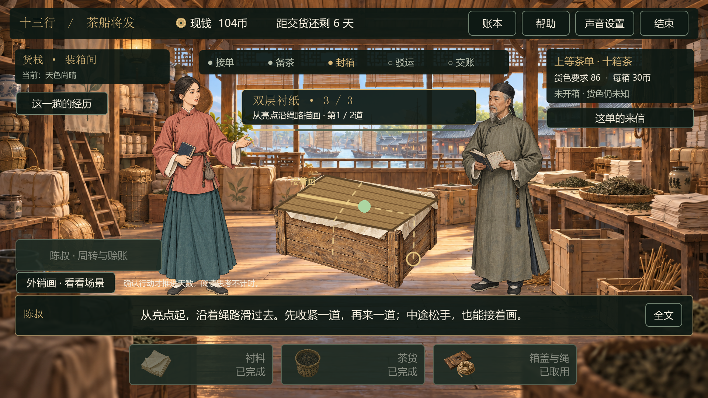

# v0.10 拖拽与手势互动

日期：2026-09-16。面向横屏单机试玩，使用鼠标左键按住拖动或原生单指触摸，把四道工序改为玩家实际操作。

## 1. 试玩路线

选择阿砚或阿宁 → 接单、采买 → 验茶选择「看汤色」 → 需要加工时进入复焙并取竹铲翻茶 → 包装、封绳 → 码头拖箱上船 → 驳运、交货、结算。

抽样检查只需观察两项，因此不强制每局晃杯；不复焙的生意也不强制翻茶。封绳与装船随正常贸易流程出现。单机模式可停留练习。

## 2. 四种操作

| 工序 | 操作 | 完成条件 | 中途松手或失误 |
|---|---|---|---|
| 装船 | 按住岸上整组箱子，拖到船上同形轮廓 | 对齐变绿后松手；4＋3＋3共三轮 | 放偏回岸上，重新拖动；不计入已装数量 |
| 看汤色 | 按住茶杯，左右轻晃 | 有幅度的交替轻晃三次，再松手 | 小范围抖动不计数；已完成次数保留 |
| 翻茶 | 按住竹铲，沿茶盘椭圆绕行 | 沿一个方向累计一圈，再松手；顺逆均可 | 可重新抓取接着翻；直线跳过、离开茶盘不增加进度 |
| 封绳 | 从亮点沿虚线描画，松手收紧，再画第二道 | 顺序走过两条折线，分别松手完成 | 保留已描部分，从亮点继续；直奔终点不能跳过拐角 |

### 形状与引导

- 三轮箱组采用四箱方阵／错列、三箱折角、三箱横排；本局种子决定部分镜像变化，三轮排列不同。
- 抓住任意一只箱子都会移动整组，保留按下时的抓取偏移。目标为同一箱组轮廓，无需旋转或逐箱摆放。
- 岸上／船上标签、金色轮廓、对齐后的绿色轮廓、已装数量和短对白共同提示。
- 茶杯随手移动并轻微倾斜，竹铲和茶叶跟随绕盘动作；绳子只绘制玩家已经走过的路径。
- 完成后保留约0.4秒落位反馈，再提交该步骤。单击或空等不会代替手势。

## 3. 容错与经营规则

- 鼠标和触摸使用同样的命中区域与轨迹规则；单次只跟踪一根手指。
- 重试不额外扣钱、扣天数或重抽随机数。资金、货色、运输风险仍由原有经营选择决定；手速不带来利润加成或扣罚。
- 模态弹窗与窗口失焦暂停动作并解除抓取；恢复后重新按住工具。晃杯、翻茶和描绳保留有效进度，未落位的箱组回到岸上。
- 取消触摸、额外手指与触摸附带鼠标事件不能提交工序；退出本局取消未完成动作。
- 沿用阶段与版本号校验，每步只提交一次；十箱装妥前不能进入路线选择。

## 4. 实现与素材

- `prototype/scripts/gesture_workshop.gd`：设备抓取、轨迹判定、完成信号及可动道具／路径绘制。
- `prototype/scripts/main.gd`：工序入口、进度提示、弹窗暂停、焦点处理和一次性提交。
- `prototype/scripts/packing_effect.gd`：手势描绳期间保留箱盖与衬料，把绳线交给实际路径绘制。
- `trade_session.gd`未改动；手势层独立于经营数值，箱组排列也不消耗经营随机数。
- 内置ImageGen生成独立透明茶杯，原图直接加入工程；箱子与竹铲复用现有素材。见 [资产台账](资产台账.md)与 [完整提示词](../art_source/prompts/v0.10-tea-cup.txt)。

当前为场景中的道具交互与图层动画。未接入人物骨骼手臂、逐帧口型、力反馈、多人同时操作或数字分身；原有点击选择保留在订单与经营决策处。

## 5. 验证与发布

- 新增真实视口鼠标／触摸事件测试，覆盖三种箱组、正确／错误落位、对齐未松手、双指、取消触摸、混合输入、晃杯抖动、翻茶越界、封绳捷径、重复点按及暂停恢复。
- 实际GPU、1920×1080、30帧Compatibility模式：119项检查通过，并从封绳继续走完三轮装船、航行、实际验收、结算与陈叔收尾。
- 3,051项UI检查；工序演出239项、订单与装船220项通过。3,000局经营回归：1,947盈利、1,046亏损、7持平，与原规则一致。这些是固定测试策略的结果，不是游客胜率预测。
- 实际GPU截图保存在 `artifacts/v0.10/screens/`；精选截图随本说明纳入版本管理。
- 构建工具从干净提交打包，重新解压后验证音乐、角色、工序、兼容、天气、订单与手势；另以1280×720、30帧Compatibility模式执行完整手势交易。
- 两首完整MP3与便携引擎随包保留。最终验证记录及哈希写入版本输出目录；下载见 [v0.10.0 Release](https://github.com/MyLittleShrimp/13-Hongs-Manager-by-LittleShrimp/releases/tag/v0.10.0)。

本地测试没有替代真实触摸硬件回测；Snapdragon 860／Windows 10 21390.2025设备仍待验证。现场试玩与数字分身按用户安排后置。
