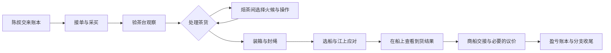

# v0.4 · 单机茶叶篇：场景操作与剧情深化

日期：2026-09-15。已进入 Godot 可玩工程。按最新要求，先完善单机游戏；现场试玩、触摸屏部署和数字分身接入后置。

## 1. 本次完成

| 环节 | 玩家看到与做到的事 | 经营影响 |
|---|---|---|
| 验茶台 | 独立茶庄内景；轻触叶形、干湿、汤色三个茶样观察点，再确认结果 | 抽样查看任意两项，获得区间；复核查看三项，获得准确货色；不重复扣验货费 |
| 焙茶间 | 独立焙茶场景；选火候，取火钳、竹铲、回凉竹筛，完成拨火、翻茶、回筛 | 费用、工期、货色提升由火候方案决定；动作不比手速，不额外扣款 |
| 装箱间 | 从工具栏取衬料、茶货、箱盖与绳，再点箱口；封箱完成有独立停留画面 | 包装的费用和保护效果沿用经营规则，手动操作不再叠加成本 |
| 货艇上 | 新增从船内看江面的场景；十个茶箱、摇动、雨丝、舱底水渍，损货会变暗并倾斜 | 保持真实概率；处置后先显示运输结果，再靠岸交验 |
| 商船交接 | 新增虚构交接人怀特的透明人物立绘和对白 | 低于规格仍须由玩家选择折价或转售；结果不能被页面刷新重抽 |
| 收尾 | 显示这一趟的经历，结尾对白和标题根据交易结果变化 | 履约、盈亏、迟交、损货和资金缺口各有对应叙事 |

总计 **7个场景、5名角色、15张美术文件**。其中一张是六件工具的透明图集，运行时分区显示，并用于取用动画。角色仍采用全身立绘加基础运动，不宣称完成骨骼动作、口型或配音。

## 2. 三种火候

| 火候 | 每次费用 | 工期 | 货色提升 | 72分茶处理一次后 |
|---|---:|---:|---:|---:|
| 常火匀焙 | 20点 | 2格 | +12 | 84 |
| 慢火细理 | 24点 | 3格 | +14 | 86 |
| 快火抢工 | 20点 | 1格 | +8 | 80 |

- 三种方案共用每局最多两次复焙的次数，货色上限100。
- 进入焙茶间仅预览；选定火候时扣钱、推进工期、占用次数。开焙前可免费返回。
- 完成三个动作后才应用货色提升。工具取用、动画、观察和思考不额外计费。
- 常火两次仍保持试玩修复中的 **72→84→96、总计40点与4格**。
- 慢火从72提高到86只是达到装船前的门槛；运输仍可能降低货色，不能保证原单最终达标。
- 补价换货仍为34点、2格、+24、每局一次。

这些是可解释的经营选择和游戏数值，并非真实制茶技术指导。

## 3. 完整单机流程

底部对白推动当前事件，顶部五段进度显示接单、备茶、封箱、驳运、交账。“这一趟的经历”可随时回看最近六件已经发生的事，不展示未来结果。

### 结尾分支

按资金缺口、转售、完整履约且不亏损、损货、迟交、货色不足、履约亏损的优先级，分别呈现：

1. 一笔未清的账。
2. 换一个买主。
3. 陈叔把账本交给你。
4. 湿了的茶箱。
5. 赶上货，误了期。
6. 货色之外，还有商量。
7. 交清了货，蚀了本。

结尾由实际结果推导。同一局同时存在多种问题时，优先显示主导结果，完整数字仍保留在账本里。零利润显示“收支持平”，完整履约且打平时有相应对白，不描述为亏损。

## 4. 单机模式

- 双击根目录的 `启动游戏.cmd`；本地便携 Godot 可直接运行，启动游戏无需 Python、联网或登录。
- 鼠标和单指触摸均可；工具操作采用“点取工具→点操作处”，避免必须精细拖拽或拼手速。
- `prototype/data/kiosk.json` 的 `kiosk_mode` 默认设为 `false`，停留思考不会自动清空本局。
- F11切换全屏；Esc打开结束菜单。主动结束或关闭程序不保留跨启动存档。
- 原展厅闲置复位逻辑保留，可通过配置启用；现场验证与数字分身联调不在本轮范围。

## 5. 延续的经营规则

v0.3的补救机制完整保留：一次借60还66、赊箱结算12、赊运结算18；现金归零不直接判负；原单要求、实际到货、达标箱数和利润分开显示。借款不是营业收入，费用和清算缺口不会被免除。

场景交互与经营随机数独立。旧按钮回调、重复观察、重复取工具、往返焙茶预览、开账本或看剧情，都不能重抽货色或再次入账。

## 6. ImageGen素材与源提示词

使用**内置 ImageGen**生成并复制原图到工程，没有走API/CLI替代路径，也未用程序改写图片内容。

| 新素材 | 工程路径 | 来源提示词 |
|---|---|---|
| 验茶台 | `prototype/assets/backgrounds/inspection.png` | `art_source/v0.4-prompts.json`：inspection |
| 焙茶间 | `prototype/assets/backgrounds/roasting.png` | 同上：roasting |
| 货艇 | `prototype/assets/backgrounds/vessel.png` | 同上：vessel |
| 商船交接人 | `prototype/assets/characters/buyer.png` | 同上：buyer |
| 六件工具图集 | `prototype/assets/props/workshop_tools.png` | `art_source/v0.4-tools-prompt.txt` |

前三张为1672×941背景；人物为1024×1536透明PNG；工具图集为1536×1024透明PNG。Godot通过 AtlasTexture 使用图集中的六格，原图保持不变。炭火、热气、茶叶移动、波纹和雨丝由引擎叠加。

## 7. 验证记录

- **经营回归**：3,000局变化策略全部到达结算；常火基准样本为1,947盈、1,046亏、7平，包含393次折价、405次转售、645次借赊清算。该样本用于回归，不代表玩家胜率。
- **工序规则**：228项定向检查覆盖三种火候、验茶信息确认、重复观察、工具顺序、重复回调、收费时机、两次加工上限、封箱、运输结果与结尾，包括收支持平。
- **UI回归**：原生触摸、双触点隔离、模态遮挡、工具取用、验茶确认、资金应急和清算通过；同时检查文本框大小与按钮每行文字宽度。
- **素材检查**：15张图片加载及尺寸检查通过；人物、茶箱和工具图集均有真实alpha通道。
- **GPU画面**：实际Godot渲染旅程覆盖验茶、三步加工、封箱、船上事件、交接人与分支收尾，证据保存在 `artifacts/v0.4/`。

渲染旅程使用显式的72货色与风雨测试情境，以稳定覆盖各分支；正常启动仍使用每局随机行情和结果。测试场景不会写入普通玩家会话。当前测试桌面为1920×1080、Compatibility/OpenGL；不代替馆内硬件测试。

## 8. 版本边界与后续顺序

本轮完成的是**茶叶篇的单机场景与剧情深化**。瓷器、丝绸、多日经营、跨启动存档、配音和角色骨骼动画尚未完成。新增历史场景、人物服装和工序均为概念表达，仍需馆方内容审定。

后续先扩充单机内容和经营可玩性，再安排数字分身、现场体验、安装部署。3–5分钟仍是展厅版本的时长目标；本轮新增操作的真实体验时长尚未作真人测量。
