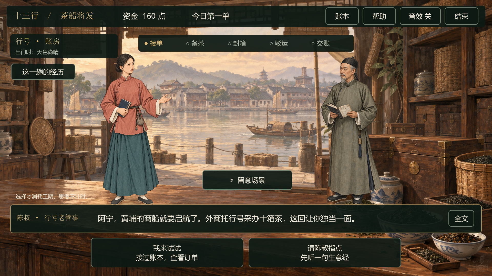

# v0.5 · 男女主角选择与切换

2026-09-16。单机茶叶篇新增女性主角阿宁，与原男主角阿砚共同作为玩家可选角色。

## 如何使用

1. 双击根目录「启动游戏.cmd」。
2. 如需换角色，点击开场右下角人物下方「阿砚 / 阿宁 · 切换角色」，选择并确认后返回开场。
3. 点击「接过账本，开张」，直接用当前角色进入剧情。游戏内没有角色切换入口。
4. 选择页点返回或按 Esc，取消本次预览。点击「再做一单」保留所选角色；完成体验或结束本局后恢复开场默认角色，下一位玩家可重新选择。

角色选择使用大尺寸人物卡，鼠标与单指触摸均可点击。人物保留入场、呼吸和说话微动。两位角色共用订单、初始本钱、可用行动与随机规则，没有性别属性加成。

## 行为与实现

- 角色卡只预览，确认才替换；取消不会开单，也不会消耗钱或工期。
- 开场陈叔的称呼、玩家对白署名和结尾署名跟随所选角色。
- 场景沿用同一个玩家节点，覆盖账房、茶市、验茶台、焙茶间、装箱间、码头和货艇。
- 角色切换只允许在开场进行，不会改变报价和随机数状态；开始游戏不会再次打开角色选择页。
- 选择入口位于 `prototype/scripts/main.gd`；资料来自 `prototype/data/avatar_profile.json` 与 `prototype/data/avatar_female.json`。
- 两位人物均为虚构的行号采购管事；服装与剧情延续现有艺术化设定。

## 新美术

- 方法：内置 ImageGen，以现有男主角为画风、比例和姿态参考，新生成女主角；没有使用 API/CLI 回退。
- 项目文件：`prototype/assets/characters/player_female.png`，1024×1536、RGBA。
- 完整提示词：`art_source/prompts/player_female_v001.txt`。
- 原始文件：`C:/Users/MyClaw/.codex/generated_images/01a0a4d5-975d-72a1-bac2-66ecfb823f89/exec-148ca664-89d7-458c-8c55-c6cf46c6c246.png`。
- 设计：低髻、木簪、赭红上衣、青绿长裙、布鞋，持账本的成年女性。透明原图直接复制入工程，没有程序重绘或抠图。

工程现有7处场景、6名人物（2位可选主角、4位NPC）、16张ImageGen图片。

## 验证

- `test_characters.gd`：51项检查通过，覆盖开场切换、预览取消、确认后返回开场、两位主角直接开始、游戏中不再开放切换、完整女主角交易、复玩与复位；比较切换前后的经营状态及随机状态。
- 最新GPU流程截图在 `artifacts/v0.5-start/`；初版选择流程的证据保留在 `artifacts/v0.5/`。
- 原有UI回归：2,322项检查通过，包含鼠标、触摸、模态遮挡、重复加工、资金应急、结算与文本边界。
- 全部16张图片通过引擎加载检查，女主角具有真实alpha与透明角落。

```powershell
python tools/run_godot.py --headless --script res://tests/test_characters.gd -- --self-test
python tools/run_godot.py --headless --script res://tests/test_ui.gd -- --self-test
python tools/run_godot.py --headless --script res://tests/check_assets.gd
python tools/run_godot.py --resolution 1920x1080 --audio-driver Dummy --script res://tests/test_characters.gd -- --self-test --capture-characters
```



