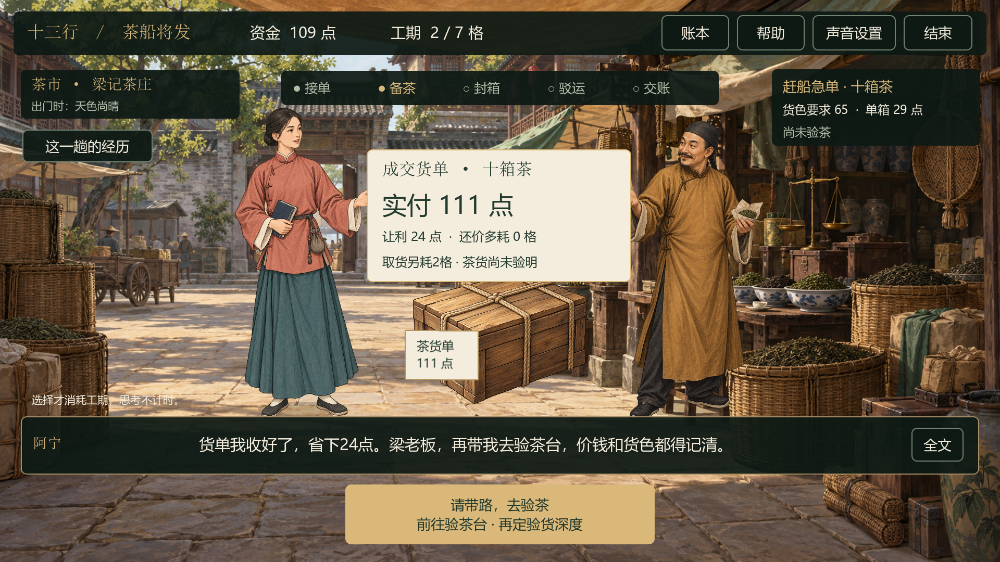

# v0.6 · 茶市议价深化

2026-09-16。本轮先完成茶市一段的剧情与经营反馈，作为后续扩展验茶、复焙和交付的样板。

## 如何试玩

1. 双击项目根目录「启动游戏.cmd」，开场选阿砚或阿宁后直接开张。
2. 接一笔订单，到茶市选择货源。
3. 点击「先问一句」，可问货源、船期、茶样与整批的关系；也可直接谈价。
4. 选择照价成交、温和还价或坚持压价。梁老板根据实际随机结果作出回应。
5. 看货单上的实付、让利与耗时，点击「接过货单」，听主角回应。
6. 点击「请带路，去验茶」。后续验茶、码头及收尾会回扣这次议价的经历。

每个话题本局只能问一次；已问话题禁用，始终可以返回议价。问话与阅读不收费、不消耗工期。成交后的交割增加两次继续操作；动作不要求抢点或比手速。


## 五种结果怎样发生

| 选择 | 真实规则 | 人物回应与后续影响 |
|---|---|---|
| 照价收货 | 当前报价成交，无额外议价等待 | 梁老板爽快开单；主角把时间留给后续工序 |
| 温和还价，成功 | 70%成功，省下报价的8%，金额取整 | 梁老板让利，验茶时提及货单上的让价 |
| 温和还价，失败 | 原价成交，多耗1格 | 梁老板说明无法让价，船家与结尾回看等待 |
| 坚持压价，成功 | 35%成功，省下报价的18%，金额取整 | 梁老板迟疑后让价，主角记下节省的本钱 |
| 坚持压价，失败 | 原价成交，多耗2格 | 梁老板坚持报价，主角承认时间代价，后续仍可亏本 |

报价、初始货色、劣批与运输风险沿用原有随机规则。让价与等候直接进入资金和工期；收尾根据最终盈亏回看这次选择。问话提供决策信息，不额外赠送成功率、资金或隐藏的品质加成。

## 场景与动作

- 茶市中央增加货箱与报价／成交货单，两位角色同场对话。
- 付款标记从主角侧移向茶商，货单再交回主角；让价与拒绝对应不同的进退和身体微动。
- 玩家接单后才进入验茶场景，讲话署名与说话角色随阿砚／阿宁变化。
- Main Theme与13 Hongs继续顺序循环，问话、交割与转场均保持音乐进度。
- 美术仍使用现有ImageGen原图；本轮动画为立绘移动与Godot绘制效果。面部表情、骨骼动作及配音留待后续。



以上为Godot实际渲染画面。QA使用固定随机种子覆盖成功与失败；普通启动仍随机。后续验茶截图另有明确的72／86低货色情境，用于验证补救对白。

## 后续反馈与信息边界

- 刚到验茶台时，梁老板会提及已省的钱或多花的时间，提醒玩家决定验货深度。
- 未验货只说货色未知；抽样区间跨过订单门槛时，只说不能确定达标；复核后才按已知结果谈补救。
- 议价耗时已计入总工期，阿顺会提示本次等待与当前剩余船期。
- 结尾回扣本局真实让利、等待和最终盈亏；省下采购钱也可能亏损。
- 问话会记入「这一趟的经历」，成交价留在账本。再做一单清空本单问话和议价记忆。

## 实现与验证

经营状态仍由 `trade_session.gd` 统一维护。新增 `bargain_chat`（可选问话）与 `bargain_result`（商家回应／主角接单）阶段；采购时一次完成随机判定与记账，后续对白只推进剧情。`market_story.gd` 从已确定的交易与验货信息生成短对白，`market_exchange.gd` 负责交割动画。

验证结果：

- 600组固定种子／策略对照：问与不问取得完全相同的成交资金、工期、货色和随机状态；两种议价方式均覆盖成功与失败。
- 防重复提交、付款后不可重谈、交割不重复收费、资金不足不重抽、抽样信息边界、触摸点击、模态遮挡与动画保护通过。
- 3,000局完整交易全部结算，包含1,947局盈利、1,046局亏损、7局持平；账本守恒、债务清算与品质补救通过。
- 240项工序、51项角色流程、21项音乐检查和2,784项既有UI检查通过；两位主角及五种成交回应均有实际GPU画面。

样本用于回归验证，不代表游客胜率或历史经营统计。本机原有的Godot系统根证书读取提示仍存在，离线流程不受影响。现场触摸驱动、3–5分钟真人完成时长与全天运行尚未验收。

```powershell
python tools/run_godot.py --headless --script res://tests/test_market.gd -- --self-test
python tools/run_godot.py --resolution 1920x1080 --audio-driver Dummy --script res://tests/test_market.gd -- --self-test --capture-market
```

## 下一段

优先深化验茶与复焙：让主角和陈叔根据未验、抽样、复核、首次复焙及再次补救作出短回应，再逐步增加货物变化与操作动作。新增委托故事、更多商品、现场试玩和数字分身在后续阶段推进。
