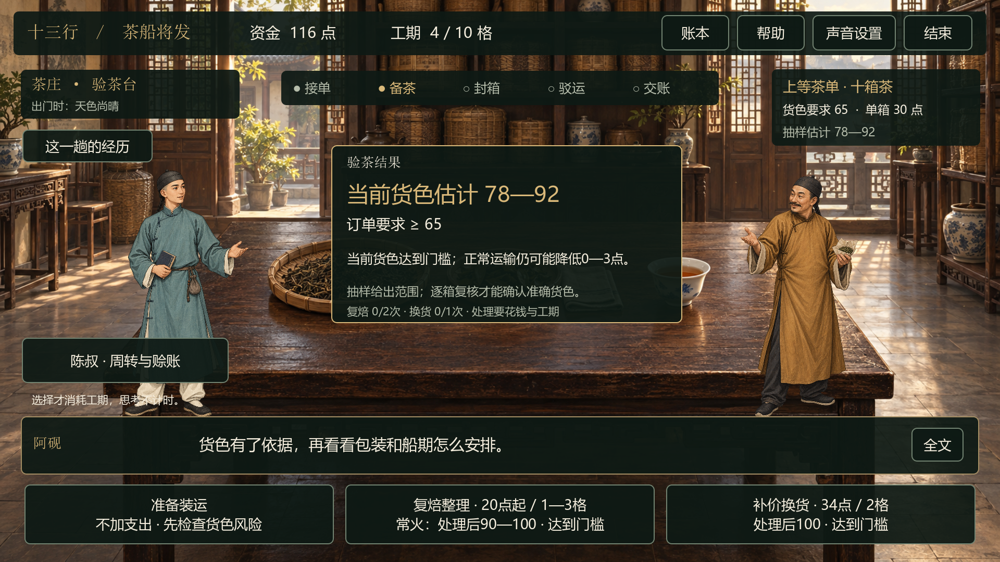
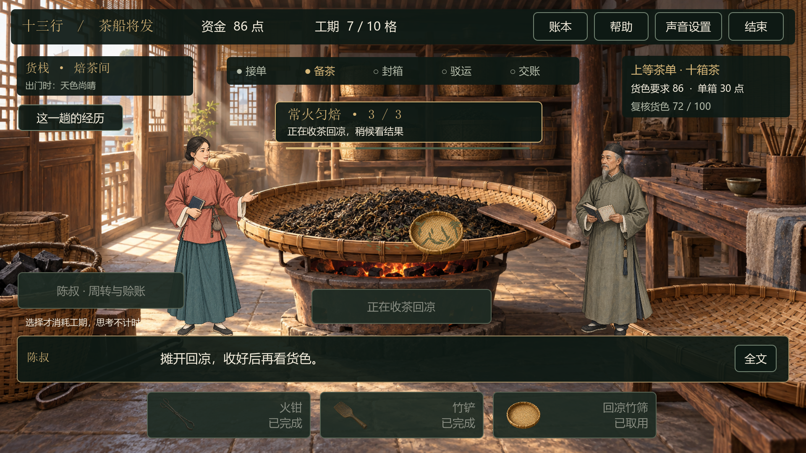

# v0.7 · 验茶结果与工序演出

日期：2026-09-16。当前重点仍是单机茶叶篇，现场触摸屏联调与数字分身后置。

## 一、中央消息框直接展示验货结果

点击「记下验茶结果」后，场景中央显示一张结果卡，右上角订单摘要继续保留。

| 信息 | 示例／行为 |
|---|---|
| 当前货色 | 抽样显示「当前货色估计 78—92」；逐箱复核显示「当前货色 72」 |
| 订单要求 | 同时显示「订单要求 ≥ 86」，方便直接比较 |
| 判断提示 | 显示尚差多少、估计范围跨过门槛，或当前达到门槛及运输风险 |
| 处理变化 | 显示「常火匀焙：72 → 84」，第二次处理显示「84 → 96」 |
| 补救次数 | 保留复焙、换货次数和处理需花钱、花工期的说明 |

没有验货时显示「当前货色未知」，不能通过加工结果卡获得隐藏的准确品质。抽样后加工仍显示范围，例如「78—92 → 90—100」，不会变成精确值。上述数字是定向测试情境，普通游戏仍使用每局随机货色。



## 二、把六项操作做成短演出

游客点击后先看动作，动作完成后再记录本项结果。单段约1.25—1.8秒，期间的短对白直接完整显示；动作后的反馈保留原有逐字显示与「全文」按钮。

| 操作 | 场景表现 | 时长 |
|---|---|---|
| 看叶形 | 茶样提起、摊开，人物靠近观察 | 1.25秒 |
| 辨干湿 | 茶叶放大并弯动，表现捻叶观察 | 1.35秒 |
| 看汤色 | 茶汤波纹、热气与观察范围提示 | 1.5秒 |
| 拨匀炭火 | 火钳往返、炭火火星起落 | 1.3秒 |
| 翻茶散湿 | 竹铲扫过、茶叶扬起再散开，热气上升 | 1.65秒 |
| 收茶回凉 | 竹筛带茶移离热源、轻晃摊开，热气减弱 | 1.8秒 |

最后一步回凉期间仍停留在焙茶间。完成后才更新货色并回到验茶台，陈叔根据处理后是否达到门槛作出回应。阿砚和阿宁共用全部流程。



这是现有ImageGen场景、单姿态立绘和道具配合Godot实时动画的表现。当前没有新增骨骼手臂动作、表情序列、口型或配音。

## 三、操作与经营规则

- 抽样、复核、火候方案的原有收费与工期保持一致；观看工序演出不额外收费，也不重抽随机数。
- 演出期间禁用重复操作、提前确认和资金周转入口，避免同一动作被重复提交。
- 打开帮助、账本等弹层时暂停工序动作；关闭后继续。结束本局会取消未完成动作，不能把回调带入下一局。
- 抽样仍任选两项，逐箱复核查看三项；每次复焙仍需取用对应工具，再点击操作点。
- 货色84仍低于要求86，中央会明确提示差2点。可以再复焙、补价换货，或确认风险后装运；未达规格的交付继续走显式折价／转售流程。
- 议价选项保持「谈成可省多少点」的表达，不重新加入成功率和节省百分比。

## 四、建议试玩路线

1. 在开场选角色，接单后去茶市采购。
2. 选择抽样，观看任意两项观察动作，点击「记下验茶结果」。检查中央的估计范围与订单要求。
3. 另开一局选择逐箱复核，查看中央准确货色。
4. 选择复焙与火候，依次取火钳、竹铲、竹筛并操作。留意最后的回凉过程和处理前后对比。
5. 工序中打开帮助再返回，或结束后重新开张，检查恢复与复位。

普通游戏不保证出现固定数字；用于复现78—92、72→84→96等案例的测试脚本不影响普通开局。

## 五、验证记录

| 检查 | 结果 |
|---|---|
| 实际GPU计时专项 | 239项通过，含10张截图保存检查；覆盖六项动作、信息精度、二次复焙、暂停恢复、连点和取消 |
| 经营模型 | 3,000局全部可结算；1,947盈、1,046亏、7平；282,200项检查通过 |
| 工序规则 | 240项通过 |
| UI回归 | 2,748项通过 |
| 男女角色 | 51项通过 |
| 背景音乐 | 21项通过 |

测试使用Godot原生触摸事件注入和实际GPU渲染；没有把它等同于馆内触摸屏驱动验收。当前桌面上的离线游戏仍有既存的系统根证书读取日志，不影响上述测试。3—5分钟真人体验、历史内容审校、全天运行和正式部署仍待后续。

运行专项测试：

```powershell
python tools/run_godot.py --headless --script res://tests/test_performance.gd -- --self-test
python tools/run_godot.py --resolution 1920x1080 --audio-driver Dummy --script res://tests/test_performance.gd -- --self-test --capture-performance
```

第二条会在实际窗口渲染并保存10张测试截图至 `artifacts/v0.7/`，完成后自动退出。README展示的图片为其中选取的实际引擎画面。

## 六、后续深化顺序

接着做装箱、封绳与装船交接的连续演出，再加强船上风雨、受潮、损货和交付回应。茶叶篇完整后，再评估更多货品和连续多单经营。
