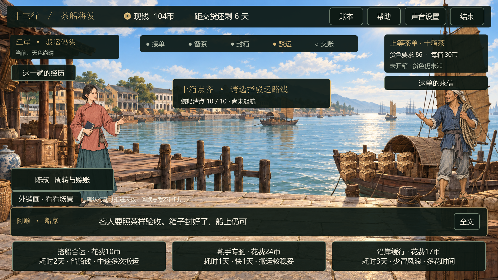

# v0.9 订单故事与装船演出

日期：2026-09-16。目标：让接单的理由、经营途中的提醒和实际交货结果相互呼应，并把封箱至装船的动作衔接起来。

## 三份有来由的委托

| 委托 | 开场缘由 | 经营途中 | 收尾依据 |
|---|---|---|---|
| 稳妥茶单：老客又来订茶 | 上回按约交齐，老客再次托怀特订茶 | 梁老板提醒兼顾本钱、取货时间与货色；陈叔提醒包装与周转；阿顺点齐箱数 | 按期、齐货、货色合约才算守约；赚钱不抹去少交、迟交或货色不足 |
| 赶船急单：黄埔有船等着茶 | 装货清单还缺十箱，客人愿加价催办 | 提醒现货与远仓的取舍；封箱、码头按实际天数提示交期；保留议价等待的回应 | 分别回应按约交清、迟交、品质不足、少交；迟交引用实际天数和扣款 |
| 上等茶单：这一回，要照茶样交 | 上回退过一批货，这次带茶样请怀特把关 | 高价不能代替开箱验货；封箱时回应已复焙次数；驳运提醒防潮 | 引用到货货色；达标后仍核对箱数与交期，低于标准时如实说明折价 |

接单页新增三张图文委托卡，下方保留对应的价格、期限、货色与迟交扣款。接单后可随时点击右上角「这单的来信」；看信不扣钱、不推进天数、不改变随机结果。委托摘要也记入「这一趟的经历」。


故事中的客人与来信均为游戏虚构。没有新增客人声望、隐藏奖励或跨局关系值，也没有预设下一单必然回购。原有三个订单的经营数值保持不变。

## 结尾如何反映经营结果

结尾先回应接单时的委托，再由陈叔核对生意账。委托结果与利润分别读取实际清算数据：

- 如期交齐且货色达标，可以仍然亏本；不会因剧情成功补回损失。
- 货色达标但迟交，仍显示迟交及扣款；品质不能替代船期。
- 货色不足选择折价，明确原单没有完全履约；转售则明确原单已取消。
- 损货后按实际箱数回应；借赊清算后还有资金缺口，照实保留。
- 多项问题并存时，委托对白优先回应该类订单最在意的问题，完整数量、货色、交期与账目仍保留在结算和账本中。

## 封箱至装船的连续操作

1. **铺衬压角**：衬料展开落入箱口，取材颜色随包装方案变化。
2. **装茶摊平**：茶篮倾斜、茶叶落入并留在箱内。
3. **压盖扎绳**：箱盖落下，绳索沿箱面收紧；播放完毕后显示封妥的箱子。
4. **码头点货**：阿顺接应，按四箱、三箱、三箱分批搬运，画面与中央计数依次显示 0→4→7→10。
5. **选择驳运**：十箱全部点齐后选择路线，再按原规则产生航行事件。



六段动作共约10.7秒，不计玩家阅读与点击时间。角色使用既有立绘的移动、微动和倾身，物件使用图层运动与Godot绘制；尚未接入骨骼搬运动作、口型或配音。没有生成或改写美术原图，继续使用30张ImageGen PNG、4张历史参考JPEG与两首MP3。

操作演出不额外收费、不增加游戏天数，费用继续在选择包装、路线等经营行为时记录。动作完成后才提交一次操作；演出中重复点击被拦截。打开来信、帮助或原画暂停工序，返回后继续；结束本局取消未完成动作，避免推进下一位玩家的游戏。

## 实施位置

- `prototype/scripts/commission_story.gd`：三份来信、经营对白及按实际结果生成的收尾。
- `prototype/data/trade_v2.json`：用 `story_key` 关联订单与故事，价格与风险参数未改。
- `prototype/scripts/trade_session.gd`：新增 `loading_work` 阶段、三批装船状态及重置。
- `prototype/scripts/workshop_performance.gd`：封箱和装船共用可暂停、可取消的计时演出。
- `prototype/scripts/packing_effect.gd`、`loading_effect.gd`：工序视觉图层。
- `prototype/scripts/main.gd`：委托卡、来信窗口、人物站位、动作入口及收尾画面。

## 验证与复查方式

- 3,000局经营回归、309,236项检查：1,947盈利、1,046亏损、7持平；与上一版相同测试策略的结果一致。这个样本不是游客胜率预测。
- 2,981项UI检查，244项工序检查，51项双主角检查，600组议价／23,327项检查，以及289项天气与原画检查通过。
- 新专项实际GPU运行236项检查，覆盖三份来信、结尾分支、六段计时动作、原生触摸、暂停恢复、重复计数防护、退出取消和账目／随机状态不变。
- GPU画面已检查委托卡、来信、封箱、点货、选路线及收尾，证据在 `artifacts/v0.9/`。结尾边界画面使用明确构造的测试结算数据，不是随机玩法的必然结果。
- 发布构建从干净Git提交取源码，最终ZIP重新解压后检查双曲音乐、双主角、演出、委托装船、天气原画与30帧触摸兼容入口。

运行新专项：

```powershell
python tools/run_godot.py --headless --script res://tests/test_commissions_loading.gd -- --self-test
```

实际画面记录：去掉 `--headless`，末尾加 `--capture-commissions`。原Snapdragon 860／Windows 10 21390.2025仍需在设备上回测，未以本机测试代替硬件验证。

## 后续单机深化

下一步集中到船上：加强风雨、受潮和损货的可见反馈，并让怀特的验收交接更像一场有来有往的对话。完成茶叶篇后，再评估瓷器、丝绸和连续多单；现场试玩与数字分身按既定顺序后置。
