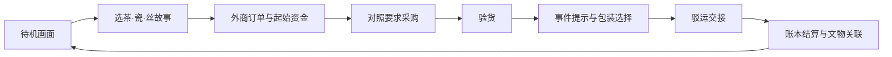
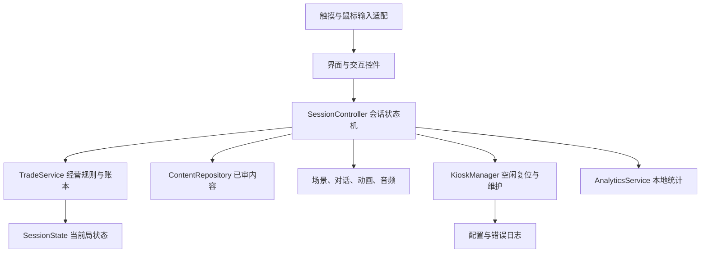

# 广东省博物馆「十三行」模拟经营互动小游戏
## 可行性分析与具体实施计划

> **实现更新（2026-09-15）：**已推进到《十三行·茶船将发》v0.4单机茶叶篇，包含七场景、五角色、验茶／复焙／封箱操作、随机经营、补救与分支收尾。按用户最新要求先完善单机游戏，现场试玩和数字分身接入后置。最新状态见[v0.4说明](docs/v0.4单机场景与剧情深化.md)与[实施进度](docs/实施进度.md)。本文保留初始立项方案，其中固定路线示例已由新版随机规则替代。

**暂定项目名：十三行·一单通商**\
**文档版本：v1.0｜编制日期：2026-09-15**\
**用途：立项讨论、馆方内容沟通、制作排期与供应商工作范围确认**

> 已确认条件：服务于广东省博物馆的现场参观体验；二维、轻剧情、策略经营；横向触摸屏；单局 3–5 分钟；优先采用 Godot；场景、角色、道具拟通过 ImageGen 制作。
>
> 本文是实施建议，尚未经过馆方审定或现场设备测试。历史依据、游戏化设定、工程目标和费用估算分别标明。本文交付设计与实施计划，不代表已生成正式美术资产或已完成游戏开发。

---

## 目录

1. 项目结论与推荐方案
2. 已知条件、假设与待确认事项
3. 历史定位与博物馆内容策略
4. 可行性分析
5. 核心玩法与经营系统
6. 一局完整体验示例
7. 剧情、角色与场景设计
8. 横向触摸屏交互与展厅动线
9. 内容规模与版本边界
10. ImageGen 美术制作方案
11. Godot 技术架构与数据设计
12. 硬件、部署与现场维护
13. 制作阶段、里程碑与任务拆解
14. 团队配置与职责
15. 工作量、预算与成本控制
16. 测试、试运营与验收标准
17. 主要风险与应对
18. 交付清单与启动清单
19. 参考来源与使用边界
20. 附录：ImageGen 提示词、数据样例与验收用例

---

## 1. 项目结论与推荐方案

### 1.1 总体判断

**具备实施可行性，建议先制作一条可完整游玩的茶叶订单，再扩展为茶叶、瓷器、丝绸三条主题故事。**

项目的价值在于让游客通过选择理解贸易：订单要求怎样影响采购、品质怎样影响交货、商品怎样经过商人、工匠和水运网络走向海外。游客的行为应当产生可见后果，最后再把这些后果与真实文物联系起来。

建议采用以下产品形态：

| 项目 | 推荐方案 | 原因 |
|---|---|---|
| 一句话体验 | 做一次十三行贸易中的采购管事，完成一笔外商订单 | 身份、目标、结束条件清楚 |
| 经营单元 | 一个行号货栈／铺面、一笔订单、一种主商品 | 适合 3–5 分钟理解和决策 |
| 游玩节奏 | 约 4 分钟，6–8 次有意义的选择 | 留出阅读、亲子讨论与触摸操作时间 |
| 核心循环 | 接单 → 比货采购 → 验货 → 应对事件与包装 → 驳运交货 → 结算看文物 | 操作与贸易过程建立对应 |
| 策略深度 | 资金、交期、品质之间的取舍 | 不需要复杂经济学知识 |
| 美术 | 手绘外销画气质的二维场景＋大尺寸人物与道具 | 同时兼顾地方文化、辨识度与制作量 |
| 操作 | 点选为主，吸附拖拽为辅，全部步骤可单指完成 | 减少误触，方便儿童与长者 |
| 技术 | Godot 4.x 经实机验证的稳定小版本、GDScript、Windows 原生离线程序 | 易于控制运行环境和维护 |
| 现场 | 单屏一局一组，允许亲子共同商量，由一人主操作 | 降低多人抢触导致的状态冲突 |
| 正式首版 | 3 条主题故事、12 个订单配置、9 个事件配置 | 有重复体验价值，内容量仍可管理 |
| 制作方式 | 2 周验证原型；通过后继续至约 10 周完成首版与现场试运营 | 提前发现玩法和触屏问题 |

### 1.2 立项成功的三个必要条件

1. **馆方能够提供内容审核接口。** 角色称谓、时代、商品工艺和展品关联要有明确审核人。
2. **第二周以前拿到实际触摸屏，或同型号借测机。** 鼠标上好用不能证明展厅触摸可用。
3. **首版范围保持为短局订单经营。** 铺面升级、雇员、连续多日经营、自由建造等适合后续独立版本，不进入首版开发基线。

### 1.3 推荐立项口径

> 制作一款面向广东省博物馆横向触摸屏的二维互动游戏。游客在约四分钟内，以虚构的十三行采购管事身份，处理一笔外商订单，在成本、品质与交期之间作出选择，亲历商品采买、验货、包装和水路交接，并在结算时发现相关文物所见证的贸易故事。

---

## 2. 已知条件、假设与待确认事项

### 2.1 已确认

- 场所与服务对象：广东省博物馆现场游客。
- 形式：二维、带少量剧情的策略经营小游戏。
- 屏幕方向：横向。
- 单局长度：3–5 分钟。
- 引擎倾向：Godot。
- 美术方式：ImageGen 生成场景、角色和道具，再进行整理与审核。

### 2.2 当前规划假设

以下用于估算和设计，不是馆方已经确定的规格：

| 假设 | 本文采用的基线 | 变化时的影响 |
|---|---|---|
| 屏幕比例 | 16:9 | 非 16:9 需调整布局和安全区域 |
| 屏幕尺寸 | 32–43 英寸作为首轮样机范围 | 超大屏需收拢操作区域，不能等比放大后即交付 |
| 分辨率 | 1920×1080 逻辑设计；实际输出按设备确定 | 4K 要复核贴图、字体、GPU与触控坐标 |
| 系统 | Windows 11 x64，展陈集成方提供合适授权版本 | 若为 Android／Linux，须重新验证驱动、导出与运维 |
| 受众 | 核心为 8 岁以上普通游客；低龄儿童由家长协助 | 幼儿独立游玩需要更少文字和更简单规则 |
| 语言 | 首版简体中文，关键台词普通话配音 | 英语／粤语属于明确追加工作包 |
| 网络 | 游玩完全离线 | 远程统计、更新、手机续玩另立需求 |
| 馆藏关联 | 3–6 件经馆方选定且可使用的文物素材 | 不能依据官网页面推定当前正在展出 |
| 预算与人员 | 暂未确定，按约 10 周、平均 2.5 人全职投入量估算 | 单人制作或外部审核等待会延长日历周期 |

### 2.3 开工第一周需要落实的信息

1. 屏幕型号、显示区域毫米尺寸、安装高度、倾角、触控协议、操作系统与计算主机配置。
2. 展位平面位置、旁边展柜、通道宽度、预计高峰流量和噪声限制。
3. 馆方指定历史时段、内容审核人、展品图片授权与馆内导览信息。
4. 预算上限、期望上线日期、设备与软件的运维责任人。
5. 是否需要双语、无声完整体验、轮椅操作及专门的低龄模式。

这些信息不阻碍桌面原型，但应在对应生产环节开始前确定。

---

## 3. 历史定位与博物馆内容策略

### 3.1 先确定“玩家是谁”

用户提出的“买办经营铺头、接外国订单、采买茶叶丝绸瓷器”具有清楚的游戏动机，但正式展陈中需要辨明角色职能。

十三行行商涉及广州口岸对外贸易的组织与经营；“十三行”也是沿用的通称，行数并非始终固定为十三家。这两点可用于引导文案。[故宫博物院：行商](https://www.dpm.org.cn/lemmas/241506.html)

对于“买办”，不同年代、商船和商馆语境下的职责存在差别。本次检索发现相关学术材料的摘要将买办馆与外商日常用品等事务联系起来；这一线索提示我们不宜直接把“买办”等同于可以独立承办全部出口贸易的行商。摘要尚不足以确定玩家全部职责，正式文案需要查阅全文并由馆方审定。[中国社会科学文库：广州十三行文化遗址研究相关章节（本次仅核对检索摘要）](https://www.sklib.cn/booklib/databasedetail?ID=8064664&LgS=&SiteID=122&Type=literature&fromSubID=729)

**本项目暂不把“买办”作为未经审核的正式玩家身份。** 称谓及具体业务关系由馆方结合选定年代审定。

推荐的游戏设定是：

> 你是十三行一家行号中的年轻采购管事，刚接手一处货栈与铺面。在掌柜和通事协助下，你根据外商的订单，联络供货商与工匠，安排验货、包装和交接。

- “采购管事”是帮助公众理解的**工作性称谓**，不宣称对应某种精确历史官职。
- 保留经营铺头的视觉和操作体验：柜台、货架、账簿、库存、客户来单。
- 行号承担贸易关系，玩家处理一段具体业务；这样更容易在短局中解释角色分工。
- 如果馆方明确希望以“买办”为主题，另行审定年代和职责，并相应调整订单内容和剧情。

### 3.2 时代与空间边界

**建议暂定约 1800 年前后，制作取样范围为 1795–1805 年；这是策划建议，最终以馆方意见为准。**

固定较窄时段，有助于统一服饰、建筑、旗帜、船型和商品纹样。不同年份的十三行图像不能随意拼成一幅“精确复原图”。

空间上分为：

1. **商馆区与行号货栈**：接洽、订单、账目和库存。
2. **供货与加工网络**：用简化采购图表现产地、作坊及中间流通，不让玩家在大地图里步行找店。
3. **珠江小艇驳运与黄埔外港**：用短动画表现货物交接与转运。

香港艺术馆的外销艺术藏品说明中记载了黄埔停泊洋船、货艇驳运至广州，以及商馆区岸边货艇的场景。因此，大型远洋商船不应被随意安排为紧贴玩家铺面卸货。[香港艺术馆：外销艺术](https://hk.art.museum/sc/web/ma/collections/china-trade-art.html)

“广州一口通商”在公众文案中宜说明其制度与贸易语境，避免简化为“中国一切对外往来只能发生在这里”。航线、年份和涉及国家由馆方审定。

### 3.3 优先采用本馆文物建立关联

广东省博物馆官网有《十九世纪新呱绘十三行》藏品页面，年代标为约 1840 年，可作为商馆景观及历史图像比较的候选资料。**它晚于上述约 1800 年的拟定游戏时间，不能整幅照搬后称为同年复原，也不能据此写死其当前展柜位置。**[广东省博物馆：十九世纪新呱绘十三行](https://www.gdmuseum.com/cn/col49/148773)

馆方也有十三行外销织绣品研究与教育活动基础，可以进一步寻找适合游戏的丝绸、广彩和外销图像资源。[广东省博物馆：外销织绣研究相关出版](https://www.gdmuseum.com/cn/col48/15652)、[广东省博物馆：海丝教育活动](https://www.gdmuseum.com/cn/col48/15385)

建议建立一张由馆方填充的文物映射表：

| 游戏内容 | 文物候选方向 | 游客操作中的连接点 | 馆方需提供 |
|---|---|---|---|
| 瓷器订单 | 经审定的外销瓷／广彩 | 客户图样、器形和包装 | 藏品编号、年代、图像、可讲述细节 |
| 丝绸订单 | 外销丝织品／刺绣 | 颜色与纹样要求、工艺时间 | 工艺名称、年代、纹样解释 |
| 茶叶订单 | 茶贸易相关图像／器具／档案 | 品质、包装、航程 | 可核实的装运与消费背景 |
| 贸易环境 | 十三行或港口绘画 | 商馆区、黄埔、货艇 | 图像断代、建筑说明、展示状态 |

### 3.4 三层内容管理

| 层级 | 内容 | 发布规则 |
|---|---|---|
| 史实层 | 年代、制度、文物、工艺、空间关系 | 必须有来源并经馆方审定 |
| 复原解释层 | 场景布局、人物衣着、具体装运方式 | 记录依据和不确定性，可标注“示意” |
| 游戏层 | 虚构人物、订单、价格、回合、损耗、奖励 | 清楚说明为教学简化，不能伪装成史料 |

每条知识内容配置 `source_id`、`review_status`、`reviewer`、`review_date`。未经通过的条目不能进入正式发布包。

### 3.5 教育目标与可观察行为

| 希望游客理解 | 通过什么操作理解 | 结算如何验证 |
|---|---|---|
| 外销商品要符合客户用途和要求 | 对照订单选规格或图样 | 展示一次“要求与选择”的对应 |
| 低采购价不等于最好的交货结果 | 比较成本、时效、品质 | 同时呈现利润和完整交付量 |
| 贸易依靠多人协作与运输网络 | 经过供货、验货、包装、驳运 | 用三个图标回顾协作过程 |
| 广州是商品加工与跨文化交流的节点 | 瓷器图样／丝绸纹样选择 | 接到一件真实文物的相关细节 |

例如，广彩可把景德镇瓷胎与广州加彩之间的关系做成一句解释；相关工艺关系有博物馆藏品说明支持。[故宫博物院：广彩人物纹盘](https://www.dpm.org.cn/collection/ceramic/227340.html)

### 3.6 叙事尺度

- 外商、工匠、船工和行号人员都应具备具体诉求，避免用国籍决定“狡猾”“诚信”等性格。
- 玩家可以赚取合理利润，同时对品质、承诺和劳动付出负责。
- 涉及近代贸易制度时，解释其限制与复杂性；不把历史写成没有代价的繁荣宣传。
- 首版围绕茶、瓷、丝等订单；战争和鸦片贸易如需讲述，应由馆方另设历史解释段落。
- 文物卡用经授权的真实图像；AI 画面标为游戏场景或艺术化示意。

---

## 4. 可行性分析

### 4.1 分项判断

| 维度 | 判断 | 实施依据 | 主要约束 | 验证方法 |
|---|---|---|---|---|
| 博物馆教育 | 高度适配 | 选择—后果—文物能建立联系 | 容易被压缩成单纯赚钱游戏 | 观察游客能否说出一个贸易知识点 |
| 玩法 | 可行，需严格限量 | 单订单可在几次选择内完成 | 多店、多货币、多订单会超时 | 第二周完整短局测试 |
| Godot 2D | 适配 | UI、场景、动画与本地导出可支持本项目 | 实机渲染和触控仍需验证 | 最终硬件导出测试 |
| ImageGen 美术 | 可行，但须人工整理 | 适合背景、立绘、道具变体 | 历史错误、风格漂移、分层和动画 | 先做少量样板并导入引擎 |
| 触摸屏 | 可行 | 点选和吸附式拖拽易于理解 | 误触、反光、伸手距离、多人干扰 | 儿童、长者、轮椅参与者实测 |
| 展厅运营 | 可行 | 离线运行、短局、复位可降低值守负担 | 排队、设备宕机、更新流程 | 试运营及长时间运行测试 |
| 内容审核 | 可控但影响工期 | 用来源登记与审核节点管理 | 馆方审核等待、年代方向改变 | 第一周确定审核窗口 |
| 成本 | 小团队可承担 | 固定镜头与复用界面减少制作量 | 人工修图和现场维护不可省略 | 按工作量计价并预留返工 |

### 4.2 Godot 适用性

本项目主要是二维 UI、背景切换、简短动画和状态计算，不需要大规模三维渲染。Godot 的 Windows 原生导出可以作为离线交付基础；发行时需要准备对应导出模板和完整运行文件。[Godot：Windows 导出](https://docs.godotengine.org/en/stable/tutorials/export/exporting_for_windows.html)

Godot 使用 MIT 许可证，允许商业使用与分发，但应保留相应版权和许可信息。交付包建议放置完整的引擎及相关第三方许可文本，方便离线查阅。[Godot：License](https://godotengine.org/license/)

**引擎建议：** 立项时从 Godot 4.x 稳定版中选定一个通过目标设备验证的小版本，并锁定编辑器、导出模板、插件和构建方式。本文不把某个未经实测的版本称为最终指定版本。

### 4.3 ImageGen 的收益与实际边界

能显著帮助的部分是概念探索、场景氛围、静态人物和道具绘制。制作成本仍包含历史资料整理、提示词迭代、风格统一、透明边缘清理、图层拆分、导入和质量检查。

下列内容须用可控的后期或引擎工具制作：

- 中文、数字、订单字段、按钮和进度条。
- 精确可点选的区域、九宫格面板与动态状态。
- 稳定的角色动作、眨眼和嘴形。
- 文物图像及其准确说明。

**可行性的验证标准不是“生成了一张好看图”，而是“一组相同风格的资产在真实触摸屏上能清楚表达操作与历史内容”。**

### 4.4 建议暂缓进入的功能

| 功能 | 暂缓原因 | 适合出现的版本 |
|---|---|---|
| 自由摆放建筑、扩大商业街 | 需要空间编辑和长期反馈 | 面向课堂／个人设备的长时版本 |
| 同时经营三类店铺 | 认知负荷大，短局难解释 | 6–10 分钟进阶版 |
| 在线多人竞争与排行榜 | 增加维护、身份和排队问题 | 有独立运营目标时再评估 |
| 现场实时生成 AI 剧情／画面 | 响应时间、内容审核和断网可用性难保证 | 作为工作人员的内容制作工具更合适 |
| 登录、手机号、扫码后才能开始 | 延缓上手 | 首版无需配置 |
| 强制精细拖拽、限时点按 | 容易测成反应速度 | 可选的趣味表现，不作通关门槛 |

---

## 5. 核心玩法与经营系统

### 5.1 一局结构



每局只有一笔订单；商品数量以一个批次表达。游客无需逐箱购买十次，也无需等待真实生产倒计时。

### 5.2 两种“时间”必须分开

1. **现实体验时间：** 目标 3–5 分钟，影响排队与内容节奏。主流程不显示不断闪烁的秒表。
2. **游戏工期：** 用 4–7 个“工期格”表达采购、验货、包装、运输消耗。思考和阅读不会消耗工期。

玩家点击提交一个经营选择时才推进工期。将跨地区贸易和加工压缩成几格，是教学抽象；不能把一格直接标成“一天”，暗示真实长途采购只需几天。

### 5.3 主要资源

| 资源 | 玩家看到什么 | 规则 |
|---|---|---|
| 资金 | “可用资金 160”＋钱袋图形 | 统一用游戏资金点，不声称对应真实银两购买力 |
| 工期 | 6 个格子，已用格和预计格颜色／纹理不同 | 采购后展示包含必要后续步骤的预计交期 |
| 货物 | 本批需求 10 箱，合格交付若干箱 | 首版按整批采购，少量损耗只在交付时结算 |
| 品质／要求 | 包装防潮、纹样匹配等易懂图标 | 2–3 项即可，不显示十多个专业指标 |

信誉作为**结算评价**，首版不设置第二套需要持续运算的可交易资源。

### 5.4 策略来源

- 低价供货通常占用更多工期；就近现货较贵但能腾出包装或加工时间。
- 更充分的包装消耗资金和工期，但能应对本局明示风险。
- 定制图样更贴合订单，但需要加工；现货可以更快交付。
- 验货帮助识别规格与瑕疵，首版为必经短步骤；不鼓励游客省掉验货来取得最高分。

**所有不可逆提交之前，都显示“本次花费、预计交期、是否满足要求”。** 事件预兆要在相关采购决策之前出现，避免玩家被事后才公开的信息惩罚。

### 5.5 三类商品的玩法差异

| 主题 | 核心问题 | 2–3 个主要选择 | 可讲述的知识 | 交互表现 |
|---|---|---|---|---|
| 茶叶：雨前装箱 | 怎样兼顾进货成本、防潮与交期 | 供货速度、包装方案 | 商品保管和远途运输的联系 | 看茶样、点选包装、封箱 |
| 瓷器：远方的图样 | 怎样满足客户要求并保护易碎货 | 现货／加彩、器形纹样、缓冲包装 | 外销需求、广州加工与贸易 | 对照样单、选择纹样、装箱吸附 |
| 丝绸：赶船的织样 | 怎样在交期内交出要求的织物 | 现货／定制、颜色纹样、复核尺寸 | 织绣工艺和海外消费 | 大幅布样切换、图案比对、卷装 |

具体茶类、织物名称、缓冲材料及工艺耗时由馆方审核；表中关系是玩法设计方向。

### 5.6 订单字段与生成原则

订单至少包括：商品、批次数量、质量／图样要求、交期、总价、预付款、事件池、结算规则、知识卡。

- 使用人工编写、经过穷举检查的订单配置。
- 正式版每类 4 个配置，共 12 个；每局抽取其中一个。
- 每局至多一个有后果的事件，事件由配置允许列表决定。
- 试玩与验收支持固定订单及固定种子，保证问题可复现。
- 新手引导配置固定，不叠加多项隐藏随机风险。
- 每个可进入的订单必须至少有一条资金足够、能够完整按期交货的方案。

### 5.7 账目与评价规则

以下为**游戏数值定义**，不是历史交易制度或真实价格。

```text
可用资金 = 起始资金 + 已收预付款 - 已支付费用
应收货款 = 按本局合格交付量和迟交规则计算的最终价款
尾款净额 = 应收货款 - 已收预付款
最终资金 = 起始资金 + 应收货款 - 全部费用
本单利润 = 应收货款 - 全部费用
```

预付款是总货款的一部分，不能在收益中算两遍。如果最终应收小于预付款，差额为退款；后台账本要表达该情况，主界面用一句话说明即可。

建议结算显示四项：

1. **履约：** 交齐了几箱、是否按期。
2. **品质：** 规格、包装是否满足这笔订单。
3. **经营：** 本单收入、支出和利润。
4. **见识：** 一条由本局选择引出的历史解释。

首版不把四项再强行加权成唯一排行榜分数。可以使用“稳妥交货”“精打细算”“巧解难题”等称号，同一局可获得多个。

### 5.8 失误与兜底

- 余额不足：展示缺少金额并保留返回修改的按钮。
- 预计迟交：在提交前用明确文字提示；允许选择并承担可理解的结果。
- 缺货或规格不符：提供重新选择或协商替代，不能卡在无按钮状态。
- 接近负利润：掌柜提示原因；帮助模式可给一次透明的推荐方案。
- 操作失败：不扣经营资源，只有确认后的商业选择才改变账本。
- 主动结束：确认后回待机，清空本局；统计记为主动退出。
- 未完成：给一句温和总结，不显示羞辱性的失败台词。

---

## 6. 一局完整体验示例

### 6.1 茶叶订单「雨前装箱」

**本节全部角色、资金、损耗和工期数字均为可测试的游戏样例。**

订单要求：10 箱茶，6 格工期内交接；完整交货总价 180 点，预付款 60 点；玩家起始资金 100 点。开局显示本局“装运有雨”，在采购之前就能查看包装代价。

| 项目 | 方案 | 支出 | 工期 | 后果 |
|---|---|---:|---:|---|
| 供货 | 远仓调货 A | 80 | 3 | 茶品质合格，调运占用工期 |
| 供货 | 就近现货 B | 110 | 1 | 茶品质合格，单价较高 |
| 验货 | 必经一步 | 0 | 1 | 确认数量与茶样 |
| 包装 | 普通方案 | 10 | 1 | 本局雨情下有 1 箱受潮不计价，选择前明示 |
| 包装 | 加强防潮 | 20 | 2 | 本局雨情下 10 箱完好 |
| 驳运交接 | 固定服务 | 10 | 1 | 结算时完成货物交接 |

本订单按合格箱数计价，每箱 18 点；超过第 6 格时，按迟交格数每格扣 10 点，扣至零为止。正式首版中，迟交上限与协商结果按每笔订单单独编写。

### 6.2 四条路线的核算

| 路线 | 总支出 | 总工期 | 合格箱数 | 应收货款 | 利润 | 结果 |
|---|---:|---:|---:|---:|---:|---|
| A＋普通包装 | 100 | 6 | 9 | 162 | 62 | 按期、少一箱，利润较高 |
| A＋加强防潮 | 110 | 7 | 10 | 170 | 60 | 完整交付、晚一格 |
| B＋普通包装 | 130 | 4 | 9 | 162 | 32 | 较早交货、少一箱 |
| B＋加强防潮 | 140 | 5 | 10 | 180 | 40 | 完整且按期，利润较少 |

这一样例将“多赚钱”和“完整按期交货”区分开，游客能看到取舍。某条路线可能在本订单中明显不划算，这是供货比较的教学机会；在其他订单中要改变交期和风险，使固定点击同一方案不能通吃。

选择 B＋加强防潮时，账本演算为：

```text
开始：100
收到预付款：100 + 60 = 160
购买就近现货：160 - 110 = 50
加强防潮：50 - 20 = 30
支付驳运：30 - 10 = 20
交货收到尾款：180 - 60 = 120
最终资金：20 + 120 = 140
本单利润：180 - 140 = 40
```

### 6.3 四分钟体验脚本

| 现实时间 | 屏幕内容与剧情 | 玩家操作 | 设计目的 |
|---|---|---|---|
| 0:00–0:20 | 铺头开张，掌柜：“先看清客人要什么。” | 点茶叶故事，点开订单 | 建立身份与目标 |
| 0:20–0:45 | 外商需要 10 箱茶；显示交期、预付款和雨情提示 | 点选订单上最重要的包装要求 | 学会看订单 |
| 0:45–1:35 | 两张供货卡并列，预览各自总工期 | 选择供货方案并确认 | 第一次经营取舍 |
| 1:35–2:00 | 茶样与箱数出现在柜台 | 点验货，确认与样单相符 | 把数字转为货物 |
| 2:00–2:45 | 船工提醒装运有雨，包装方案显示价格和耗时 | 选普通或加强包装 | 第二次经营取舍 |
| 2:45–3:15 | 木箱进入装运区 | 点选装箱或拖入吸附区，点交接 | 触摸参与与完成感 |
| 3:15–3:40 | 货艇驶向外港示意，账本逐项结算 | 点看选择带来的结果 | 清楚解释经营后果 |
| 3:40–4:00 | 文物／史料卡和一句回顾 | 看一处细节，点完成 | 连接展览并结束一局 |

表中为目标节奏，实际时长通过游客试用校准。任何长配音均可跳过；动画和字幕不要求游客等待全部播放完才能操作。

### 6.4 结算文案例子

> 你花更多钱买了就近现货，把时间留给防潮包装。10 箱茶完整、按期交到船上，本单赚得 40 点。
>
> 一笔外销生意要经过供货、验货、包装和运输，货物怎样到达目的地，也是经营的一部分。

下一屏关联馆方选定的真实文物或史料，并注明其年代。只有展品位置经过馆方确认，才显示“到某展区继续看”。

---

## 7. 剧情、角色与场景设计

### 7.1 剧情结构

采用“一次委托、一个问题、一次解决”的短篇结构。主角刚接手货栈，外商的订单带来一个具体要求，供应与装运造成取舍，最终用账本和文物回顾。

- 每局主要台词 8–12 句，每句通常 15–30 个汉字。
- 任一对话气泡不超过 2–3 行，每次只出现一位主要说话人。
- 关键说明同时有文字和可选配音，静音时仍能完整游玩。
- 史实长说明进入可选知识卡，主流程先解释眼前选择。
- 口吻亲切、略有地方生活气息；首版使用现代易懂汉语，不大量堆砌文言。

### 7.2 首版六位可见角色

玩家以第一人称经营，不单独制作可换装主角。

| 角色 | 功能 | 形象与台词方向 | 美术需求 |
|---|---|---|---|
| 行号掌柜 | 引导、困难提示、结算 | 经验丰富，关心账目与信誉 | 半身立绘＋平静／提醒／赞许 |
| 外商代表 | 提出订单 | 清楚表达用途和交期，通过通事关系交代交流方式 | 半身立绘＋平静／期待／满意 |
| 茶货供货人 | 茶叶供货 | 解释茶样、货源与包装提醒 | 半身立绘＋3 表情 |
| 瓷绘工匠 | 瓷器加工 | 展示纹样与器形选择 | 半身立绘＋3 表情 |
| 丝织作坊代表 | 丝绸供货 | 解释织样、颜色和加工时间 | 半身立绘＋3 表情 |
| 船工领班 | 驳运、事件 | 提醒雨情、装载与交接 | 半身立绘＋3 表情 |

通事在第一版可通过开场说明和文本角色出现；如需要独立立绘，则作为新增角色调整美术清单。所有角色均为虚构，不将生成肖像标成真实历史人物。

### 7.3 五个基础场景

| 场景 | 功能与视觉焦点 | 可动元素 |
|---|---|---|
| 十三行沿江概览 | 待机吸引、交代商馆与江面 | 水波、小艇、少量路人剪影 |
| 行号铺面与柜台 | 接单、货架变化、角色对话 | 账簿翻页、货物入柜、印章 |
| 采购网络图 | 两三张供应卡与流通关系 | 选中节点、简单路线亮起 |
| 验货包装台 | 商品放大、对照样单、包装 | 货物吸附、开箱、封箱 |
| 驳运交接点 | 小艇载货、外港关系示意 | 装船、货艇离岸、转场 |

茶、瓷、丝共用柜台、采购界面和包装台，通过道具和局部装饰换主题。只有必要时才新增完整背景。

### 7.4 经营铺头的可见变化

虽然每局很短，铺头仍应对玩家行为作出回应：

- 接单后柜台出现样单和预付款提示。
- 采购后空货架变成对应商品，库存数量同步更新。
- 验货发现问题时，问题货物单独摆出。
- 包装后货物变成箱／卷，交接后柜台清空。
- 结算时账簿显示本单结果，掌柜给出一句反馈。

这些变化可用预制状态切换实现，能以较小工作量建立“我正在经营这间铺面”的感觉。

---

## 8. 横向触摸屏交互与展厅动线

### 8.1 横屏布局

以 1920×1080 逻辑画布为起点，主操作区集中在中部与下部；两侧与上部以展示和辅助信息为主。

```text
┌──────────────────────────────────────────────────────────┐
│ 故事标题        当前目标        可用资金     工期预览      │
├─────────────┬──────────────────────────┬─────────────────┤
│             │                          │                 │
│  人物与短句 │    货物／场景／样单       │  当前订单摘要   │
│             │    可点击对象保持醒目    │  2–3 项要求     │
│             │                          │                 │
├─────────────┴──────────────────────────┴─────────────────┤
│           方案 A                 方案 B                  │
│      费用、工期、结果         费用、工期、结果             │
│ 帮助           返回修改                  确认本次选择     │
└──────────────────────────────────────────────────────────┘
```

同一时刻优先展示 2 个方案，最多 3 个。收起完整库存、市场和历史说明，减少视觉争夺。

### 8.2 控件与字号初值

以下是本项目的样机设计目标，不是通用的建筑或无障碍合规结论。最终按实屏毫米尺寸、观看距离和使用者测试调整。

| 元素 | 1920×1080 逻辑设计初值 |
|---|---|
| 主操作按钮 | 高 88–104 px，宽 240–360 px |
| 次级按钮 | 高至少 64 px，尽量不靠四角 |
| 方案卡 | 宽约 380–520 px，整个卡片可点击 |
| 主体文字 | 28–36 px |
| 关键数字／目标 | 40–52 px |
| 辅助说明 | 原则上不小于 24 px |
| 可点击对象间隔 | 16–24 px 起步，误触时扩大 |
| 边缘安全区 | 四边至少 48 px，现场系统手势可能需要更多 |
| 一次操作的即时反馈 | 目标 100 ms 内出现按下／选中反馈 |

尺寸换算示例：43 英寸、16:9 屏幕的显示宽度约 952 mm；在全屏无缩放裁切的 1920 逻辑宽度下，96 px 按钮高度约为 47.6 mm。4K 同尺寸屏幕应保持相同物理尺寸，而不是把按钮按原始像素缩小一半。

### 8.3 触摸动作规范

- 普通按钮使用抬手确认：手指滑出按钮可取消，减少误触。
- 卡片第一次点选只显示选中和预览；支付或推进工期由统一确认按钮提交。
- 拖拽只用于装箱等表现性环节，拖到目标附近自动吸附。
- 每个拖拽提供“点货物 → 点箱子”替代，不要求精准落点。
- 不依赖悬停、右键、双击、捏合或隐藏手势完成主要流程。
- 文本提示不能只用颜色区分：同时使用“会迟交”等文字和图标。
- 音效与视觉反馈同步，静音不影响判断。
- 模态面板显示时拦住底层交互；正在结算时不能再次扣款或交货。

### 8.4 多人触碰处理

目标是亲子合作讨论，业务状态仍按单人操作流执行。

1. 一次点按／拖拽只接受一个主指针，直到抬手或取消才释放。
2. 其他触点不触发另一笔交易，也不抢走正在拖动的货物。
3. 业务提交带有唯一动作编号及当前状态校验；同一动作重复收到也只结算一次。
4. 遗失抬手事件、窗口失焦或场景切换时，清理指针锁并回到可操作状态。
5. 真机测试手掌碰屏、两人同时点不同按钮、长按、边缘滑动和快速连点。

仅靠“禁用按钮 0.3 秒”不足以保证账目正确；输入层去重和业务层防重复提交要同时实现。

### 8.5 开始、离开与复位

| 状态 | 行为 |
|---|---|
| 待机 | 低强度水波／小艇动画＋清楚的“点此开张，约 4 分钟” |
| 开始 | 两次点击内进入订单，不输入姓名 |
| 无操作 20 秒 | 出现轻提示或手势示范，不更改玩家选择 |
| 无操作 45 秒 | 显示“继续这笔生意”与 15 秒复位倒计时 |
| 继续无操作至 60 秒 | 清空本局并回待机 |
| 知识卡／帮助阅读 | 按面板配置放宽空闲阈值，建议 90 秒；系统知道正在播放的片段不计普通空闲 |
| 完成结算 | “完成”按钮始终可见；无操作 20 秒回待机 |
| 主动退出 | 简短确认后回待机 |
| 超过 5 分钟且仍在操作 | 减少非必要台词并提示结束步骤，不因阅读较慢直接强制失败 |

空闲计时只由有效用户输入重置，动画、鼠标噪声或后台日志不能让机器永久停留在一局里。5 分钟是体验设计目标；如馆方要求严格轮换，则另外启用有明确提示的排队时限模式。

### 8.6 设备姿态与可达性

- 首轮样机建议检查显示中心距地约 1050–1150 mm、相对竖直后倾约 10–20° 的可用性；这只是人体工学试验起点。
- 把主要操作安排在实机约 850–1150 mm 高度范围内，现场测量儿童与坐姿使用者是否能触及。
- 轮椅正面接近空间、下方容膝空间、底座防倾倒和电气安全由展陈设计与集成方落实。
- 超过 43 英寸时，将交互收拢到可达区域；背景仍可铺满，操作不要跟随扩张至两端。
- 强反光、柜台遮挡、肩膀疲劳都要在实际灯光条件下测试。

### 8.7 吞吐量与排队估算

以平均游玩 4 分钟、结束及交接 0.5 分钟计算：

```text
单台理论容量 = 60 ÷ (4 + 0.5) ≈ 13.3 局／小时
按 70%–80% 实际利用率规划 ≈ 9–11 局／小时
```

这是规划估算，实际受游客流、讨论时间和是否有人排队影响；“一局”可能是一组家庭，不能直接等同于一个人。

如果高峰目标是每小时完成 24 组，按单台 10 组／小时估算需约 3 台，而不是延长单局或让同屏多人独立经营。等待区应能看清场景和结果，避免包围操作者阻断通道。

---

## 9. 内容规模与版本边界

### 9.1 分阶段范围

| 模块 | 两周验证原型 | 首版正式范围 | 后续可选 |
|---|---|---|---|
| 商品主题 | 茶叶 1 条 | 茶、瓷、丝各 1 条 | 外销画、漆器等 |
| 订单配置 | 1 个 | 12 个，每主题 4 个 | 更多馆方策展专题 |
| 事件 | 1 个固定事件 | 9 个，每主题 3 个；每局至多 1 个 | 多事件进阶模式 |
| 场景 | 柜台、采购、包装交接的简化版本 | 5 个共用基础场景 | 新时段／新地点 |
| 角色 | 掌柜＋商人，临时立绘即可 | 6 个可见角色、各 3 表情 | 主角选择、更多历史人物 |
| 教育内容 | 1 张经初审知识卡 | 12 条短知识、3–6 张文物卡 | 双语专题、教师讲义 |
| 经营 | 一单、两供应方案、两包装方案 | 一单、2–3 方案、主题差异 | 连续经营、店铺升级 |
| 硬件功能 | 实机触摸、退出、空闲复位 | 自启、守护、维护、离线更新和统计 | 远程维护、手机接续 |
| 配音 | 临时配音或无声 | 普通话关键台词、全部字幕 | 粤语、英语 |

### 9.2 首版内容量估计

- 三条故事，共用约 70% 的界面和流程。
- 全部订单与事件合计约 2,500–4,000 汉字正文，另有可选知识卡。
- 单局实际呈现的核心文字控制在约 250–450 字，视阅读测试下调。
- 每局 6–8 次主要选择，纯表现性点按另计。
- 每个主题至少一条保证可行的推荐路径，以及一条会产生可解释取舍的替代路径。

### 9.3 范围变更原则

第二周以后新增商品、语言、角色或交互手势，都应记录新增美术、文案、逻辑和测试量。第六周后冻结首发功能，仅处理可用性、内容、稳定性和既定范围内的修正。

---

## 10. ImageGen 美术制作方案

### 10.1 视觉方向

建议采用**具有外销画气质的二维手绘插画**：温暖纸色、青灰江面、木色柜台，配以茶绿、瓷蓝和绸红作为主题色。建筑与服饰依据馆方参考，交互物件轮廓清楚，人物表情温和可读。

这是一种面向公众互动的艺术化表现，避免把生成画面包装成未经考证的历史现场照片。

| 视觉层 | 制作方式 | 约束 |
|---|---|---|
| 场景底图 | ImageGen 生成＋审核修订 | 固定镜头、固定光向，给 UI 留空间 |
| 角色 | ImageGen 基准立绘＋基于基准的局部表情编辑 | 保持脸型、服装、比例和朝向 |
| 商品道具 | ImageGen 单体生成 | 同视角、同尺度，透明背景或可整理的干净背景 |
| 活动图层 | 从批准资产制作／按要求生成独立层 | 船、水、箱、灯与背景分开 |
| 中文／数字／按钮 | Godot Control、字体、矢量或九宫格资源 | 内容清楚、状态可控、可本地化 |
| 文物卡 | 馆方授权图像＋原生文字 | 图像与AI示意清楚区分 |

### 10.2 先建立美术规范，再做资产

第一批只制作三个方向样板供选择：例如“偏外销画”“偏轻绘本”“偏清晰游戏插画”。每个方向用相同场景与道具比较，避免同时改变主题导致无法判断。

确定方向后，冻结以下规范：

1. 年代与地域资料包，禁止使用的建筑、服装、物件。
2. 色板、线条粗细、纸张纹理程度、明暗对比。
3. 柜台、人物、道具各自的视角和透视。
4. 主光方向、投影方向、人物画面占比。
5. 角色基准图和商品基准图。
6. UI安全区、按钮与关键商品不得被人物遮挡的位置。
7. 文件命名、输出尺寸、透明边距和版本号。

通过标准是一张完整的 Godot 样板画面，而不是仅在图像查看器里选择最精美的画。

### 10.3 首版美术资产工作清单

以下按最终使用的文件估算，草稿和弃用版本另计。

| 类别 | 数量 | 建议交付规格 | 说明 |
|---|---:|---|---|
| 基础场景底图 | 5 | 16:9；1920×1080 上屏，原稿尽量保留更高分辨率 | 概览、柜台、采购图底、包装台、交接点 |
| 场景独立装饰层 | 10 | 按实际占屏尺寸＋适量余量 | 茶／瓷／丝换景装饰、水波、前景等 |
| 角色立绘与表情 | 18 | 6 人×3 表情；建议长边约 1536–2048 px原稿 | 各角色共用画布、站位和基线 |
| 商品图标 | 6 | 约 512×512 px 上屏资源 | 每主题 2 个可辨识样品 |
| 包装道具 | 6 | 约 512–1024 px，按占屏尺寸导出 | 每主题两种方案的视觉 |
| 工具与凭证道具 | 6 | 约 512–1024 px | 账簿、秤、封签、样单等；文字另做 |
| 船只独立层 | 2 | 约 1024–2048 px 原稿 | 本地货艇、远景洋船示意 |
| UI装饰纹理 | 4 | 无文字、可平铺或可九宫格切片 | 纸、木、印框等 |
| 原生UI图标与状态 | 约 12 组 | SVG／Godot绘制／可控PNG | 不计入 ImageGen 最终图数 |
| 授权文物图像 | 3–6 | 以馆方许可与原文件为准 | 不计入 ImageGen 最终图数 |

**ImageGen及后期关联的最终栅格文件约 57 个。** 同一文件可复用于多处；18 张人物图不是18个角色，生成次数也不等于最终文件数。

如原稿尺寸与上表不同，应记录原始尺寸并通过裁切、排版或重新生成达到使用要求；工具输出不能因为放大文件就被称为增加了真实细节。

### 10.4 生产步骤

```text
馆方参考与年代说明
    ↓
风格样板 → 美术与内容共同确认
    ↓
场景／人物／道具基准资产
    ↓
逐项生成或参考图编辑
    ↓
审核主体、历史细节、风格和透明通道
    ↓
后期整理图层、边缘、尺寸与锚点
    ↓
导入 Godot → 实屏检查 → 记录最终版本
```

具体操作要求：

- 默认采用已配置的内置 ImageGen 进行制作；本游戏运行时不调用图像生成服务。
- 每个独立资产使用单独任务与提示词，避免一张大拼图切成大量尺寸不稳定的资源。
- 为生成任务明确标注：全新生成、风格参考、身份参考或编辑目标。
- 制作人物表情时，以批准的同一基准立绘为参考，要求只变表情。
- 要求透明背景时检查真实 alpha；棋盘格画进图片不算透明。
- 每个项目使用的最终资产复制到项目目录，并保留原始提示词、参考来源、版本和审核记录。
- 不依赖提示词中的“严格一致”代替人工比对，尤其检查衣襟、手指、饰物和瓷器纹样。
- 批量生产先完成少量样本导入；若样板不能上屏，不扩大生成规模。

### 10.5 动画策略

| 动作 | 推荐实现 | 原因 |
|---|---|---|
| 人物呼吸、轻微点头 | Godot Tween／AnimationPlayer 对整张或少量分层做变换 | 稳定、制作量小 |
| 表情切换 | 已审定表情图交叉淡入 | 人物不会因逐帧生成而变脸 |
| 眨眼 | 基准脸上的眼部图层切换 | 需要专门整理眼部层 |
| 小艇、水波 | 独立图层＋路径／UV动画 | 适合循环待机 |
| 翻账本、盖章、装箱 | 关键帧位移、缩放和少量序列图 | 行为反馈清楚 |
| 布料展开 | 遮罩揭示＋纹理变换 | 避免制作复杂真实布料模拟 |
| 瓷器高光 | 局部高光层或简单材质 | 不改变器形和纹样 |

首版不要求完整口型、长距离人物行走或逐帧手绘动画。若确需骨骼动画，先拆分遮挡部位并补画隐藏区域，再评估骨架；不能把未分层立绘直接视为可绑定角色。

### 10.6 分辨率与性能预算

- 场景和角色保留原稿，上屏资源按最大实际显示尺寸导出。
- 4K单张RGBA图像的基础解码大小约为 `3840×2160×4 ≈ 31.6 MiB`；5 张同时驻留仅基础像素就约 158 MiB，未计mipmap和其他开销。显存占用还受导入格式影响。
- 将当前场景和下一场景作为预加载重点，避免全部高清原稿常驻。
- 半透明装饰不做大量全屏重叠；小道具不要导出成满屏大画布。
- 中文字体在目标设备检查缺字与清晰度，首版可用完整授权字体；如做字库子集，要覆盖全部动态文案。

### 10.7 资产审查与资料留存

每项资产记录：`asset_id`、类别、文件路径、原始尺寸、使用尺寸、提示词、参考图出处、生成／编辑方式、工具日期、版本、人工修改、历史审核状态与授权备注。

验收检查：

- 服饰、建筑、船型、纹样是否与设定时段相容。
- 是否出现现代天际线、电线、塑料、包装印刷或错误旗帜。
- 是否有不明文字、水印、多余肢体、重复商品或透视错误。
- 商品在缩小后是否还能区分，角色是否遮住主要按钮。
- 透明边缘在深色与浅色背景上是否都有白边／黑边。
- 图像中的历史内容与文物照片是否清楚区分。

使用馆方或第三方参考图前，确认允许的用途；图像生成并不自动解决参考图、字体、配音与第三方内容的使用权限。相关记录纳入交付资产台账。

---

## 11. Godot 技术架构与数据设计

### 11.1 技术基线

| 项目 | 首版建议 |
|---|---|
| 引擎 | 实机验证后的 Godot 4.x 稳定小版本 |
| 脚本 | GDScript，核心模型与UI分离 |
| 渲染器 | 先测 Compatibility；若特定效果有需要再评估其他后端 |
| 目标平台 | Windows x64 原生导出 |
| 屏幕 | 1920×1080 逻辑尺寸，优先保持16:9比例 |
| 界面 | Control、Container、Theme、CanvasLayer |
| 场景美术 | Node2D、Sprite2D、TextureRect等 |
| 动画 | AnimationPlayer、Tween和少量独立图层 |
| 内容数据 | JSON配置或自定义Resource；首版选一种为正式真源 |
| 配置与日志 | ConfigFile／FileAccess，写入user:// |
| 版本控制 | Git；大二进制资源使用Git LFS或明确的资产版本库 |
| 运行依赖 | 全部必要素材本地随包，游玩不依赖登录与网络 |

Godot官方硬件要求只是简单项目的参考基线，并明确建议在实际目标硬件测试。本项目的采购标准应以导出程序和现场环境验证结果为准。[Godot：System requirements](https://docs.godotengine.org/en/stable/about/system_requirements.html)

### 11.2 分辨率适配

初始选择 `canvas_items` 缩放模式，以保持二维界面按目标分辨率绘制，比例优先 `keep`。使用Container与锚点管理布局，背景扩展不应改变点击区域和订单可读性。这些模式由Godot多分辨率功能支持，实际选择须通过1080p与目标分辨率测试。[Godot：Multiple resolutions](https://docs.godotengine.org/en/stable/tutorials/rendering/multiple_resolutions.html)

非16:9屏可先采用留边方案，正式部署前由设计决定是否扩展背景。不能将画面非等比拉伸。Windows显示缩放、实际窗口尺寸与触控映射需作为同一个测试矩阵验证。

### 11.3 模块结构



| 模块 | 责任 | 不应承担 |
|---|---|---|
| SessionController | 流程推进、跳转、重开和统一结束 | 把所有UI计算塞入一个脚本 |
| TradeService | 资金、工期、合格量、应收与退款计算 | 直接依赖某个按钮或人物节点 |
| ContentRepository | 加载、校验订单与知识卡 | 接收现场任意文本自动发布 |
| DialoguePresenter | 台词、字幕、配音和跳过 | 根据音频播放完成决定是否扣款 |
| InteractionAdapter | 主指针、取消、去重、坐标转换 | 对一次点按自行修改账本 |
| KioskManager | 空闲复位、维护入口、状态健康信号 | 替代操作系统权限限制 |
| AnalyticsService | 本地匿名会话事件与汇总 | 收集姓名、照片或联系方式 |

### 11.4 会话状态机

```text
ATTRACT
  → STORY_SELECT
  → ORDER_REVIEW
  → PROCUREMENT
  → INSPECTION
  → EVENT_AND_PACKING
  → DELIVERY
  → RESULT
  → ARTIFACT_CARD
  → ATTRACT
```

另设 `IDLE_PROMPT`、`HELP`、`MAINTENANCE`、`ERROR_RECOVERY` 作为受控覆盖状态。返回修改只允许发生在尚未提交的选择；已扣款步骤不可通过返回再领取预付款。

每次确认调用同一个交易入口，传入 `session_id`、`action_id`、期望状态与选择参数。验证通过后一次性提交状态和账本，再驱动画面反馈。动画结束信号不能二次提交交易。

### 11.5 输入方案

Godot区分 `InputEventScreenTouch` 与 `InputEventScreenDrag`，并提供鼠标模拟触摸、触摸模拟鼠标的设置。[Godot：Input examples](https://docs.godotengine.org/en/stable/tutorials/inputs/input_examples.html)、[Godot：Input](https://docs.godotengine.org/en/stable/classes/class_input.html)

实施分两层：

1. **原型：** 普通Control按钮走一个统一鼠标／触摸事件路径，先验证操作体验。
2. **正式版：** 如采用原生触摸指针锁，明确哪些控件由适配层处理、哪些由GUI处理；关闭会导致重复业务事件的模拟路径，不同时在 `_input`、`gui_input` 和 `pressed` 中结算同一动作。

部署前实测设备是提供原生触点、鼠标模拟还是两者都有。开发时的鼠标模拟只服务调试，不替代真机多触点测试。确切配置随锁定的引擎版本和驱动写入设备配置单。

### 11.6 内容与数据对象

| 对象 | 最少字段 |
|---|---|
| StoryDef | ID、标题、商品主题、开场、订单池、文物卡 |
| OrderDef | ID、数量、规格、交期、总价、预付款、供应方案、结算策略 |
| SupplierOption | 费用、采购工期、商品批次、限制条件 |
| PackagingOption | 费用、工期、能处理的风险、视觉资产 |
| EventDef | 提示阶段、适用主题、前兆、选择与后果 |
| ArtifactDef | 本地图片、名称、年代、来源、授权、展位信息及有效日期 |
| KnowledgeDef | 短解释、适用事件、来源、审核状态 |
| SessionState | 唯一局ID、阶段、资金、工期、货物、已提交动作、帮助标记 |
| ResultData | 应收、尾款／退款、成本、利润、交付量、迟交量、称号 |

导入时检查：ID唯一、引用存在、金额非负、预付款不超过全额、至少一条完整按期交付路径、文物卡已有审核、没有重复动作键。内部调试可以载入草稿，正式构建只接收已通过的内容清单。

### 11.7 建议目录

```text
hongs_manager/
  project.godot
  scenes/
    app/             # 启动、待机、维护
    gameplay/        # 柜台、采购、包装、交接
    ui/              # 订单卡、方案卡、结果、帮助
  scripts/
    core/            # 会话、经营规则、内容加载
    input/           # 指针、触摸适配
    presentation/    # 对话、动画、声音
    operations/      # 复位、日志、健康信号
  data/
    stories/
    orders/
    events/
    knowledge/
    artifacts/
  assets/
    backgrounds/
    characters/
    props/
    ui/
    audio/
    fonts/
  tests/             # 经营规则、内容校验、流程与复位验证
  docs/              # 历史审核、资产台账、设备与维护说明
  LICENSES/
  build/             # 输出包，不作为源资源目录
```

ImageGen原稿、提示词和分层源文件可放在独立的 `art_source/` 目录；不将未使用的高清原稿全部打包进游戏。

### 11.8 本地保存与统计

运行配置和统计写入 `user://`，不写入安装包只读目录。Godot提供本地文件及JSON序列化方式，可用于配置与记录。[Godot：Saving games](https://docs.godotengine.org/en/stable/tutorials/io/saving_games.html)

首版策略：

- 游客没有跨局个人存档；退出或崩溃恢复后从待机开始。
- 配置、已审内容版本、设备版本与汇总统计持久保存。
- 日志追加写入，设置按日轮换和总大小上限；建议原始会话事件保留30天、汇总保留12个月，最终由馆方决定。
- 统计仅包含随机会话ID、主题、时长、阶段、帮助、选择和结束类型。
- 区分完成、主动退出、空闲复位、崩溃中断；崩溃前已开始的局在下次启动记为中断，避免完成率虚高。
- 维护人员通过受控入口导出CSV／JSON；首版无需服务器或数据库。
- 配置采用临时文件写入、校验后替换，并保留上一份有效配置。损坏时回默认值，不能启动即崩溃。

### 11.9 性能工程目标

下列是待验收目标，不是当前测得结果：

- 目标设备1080p运行目标60 FPS；主要交互场景帧时间P95不超过20 ms。
- 点击可见反馈P95不超过100 ms，独立测量输入到呈现，不能只用帧率代替。
- 场景切换P95不超过1秒；必要时预加载。
- 程序启动到待机目标10秒以内，不含操作系统启动。
- 首版工作集内存预算暂定1.5 GiB以内；以样板资产实测修订。
- 8小时循环运行，预热后没有持续增长的内存趋势；同一待机状态末次内存相对基线增长目标小于10%。

---

## 12. 硬件、部署与现场维护

### 12.1 设备建议

已有屏幕优先借测，暂不指定品牌或下采购结论。下表是供集成方选型与送样的需求范围。

| 项目 | 建议基线 | 验证重点 |
|---|---|---|
| 显示 | 横向16:9、32–43英寸首轮样机；1080p或4K | 反光、侧视、文字与安装距离 |
| 触控 | Windows兼容，支持稳定单指并能报告多触点；10点触控可作为选型项 | 不等于必须设计10人同玩；重点看误触、偏移和驱动 |
| 主机 | 近年四核以上x64平台，16GB内存，256GB以上SSD | 样板实测帧率、启动和长时间散热 |
| GPU | 可先测集成显卡，无需预先要求独显 | 以目标渲染器、驱动与4K输出验证 |
| 系统 | 合法授权、处于支持范围的Windows版本 | 原生程序锁定方案和设备驱动 |
| 音频 | 内置或定向扬声器，硬件及软件限音量 | 相邻展项声音干扰 |
| 结构 | 商用底座／柜体、隐藏走线、可维护接口 | 防倾倒、边角、电气、散热由集成方验收 |
| 电源 | 正常关机方案；按现场供电条件评估UPS | 避免将每日直接断电当作常规关机 |
| 网络 | 游玩离线；维护网络按馆方策略可选 | 拔掉网线后全流程可玩 |

采购时明确设备的允许连续运行时长，并由供应商说明售后和备件。电容触控与红外触控均需实测；不要仅凭“多点触控”参数推断掌心拒触、抗遮挡或准确性。

### 12.2 展陈锁定不等于游戏全屏

Godot全屏只负责应用呈现。开机进入应用、禁止游客进入桌面、限制系统边缘手势、维护退出与异常重启，需要操作系统和集成方一起处理。

对于Godot导出的传统Windows桌面程序，可评估Shell Launcher。微软文档说明它能以桌面应用替换默认Shell，适用版本包括Enterprise、Education及IoT Enterprise等；**Shell Launcher本身不阻止用户访问其他系统组件**，仍需配合账户和访问策略。[Microsoft：Shell Launcher](https://learn.microsoft.com/en-us/windows/configuration/shell-launcher/)

微软Assigned Access中的单应用kiosk路径主要针对UWP应用或Microsoft Edge；不要把它直接当作任意Godot EXE的单应用锁定方案。若设备只有Windows Pro，应由集成方验证适用的受限体验配置或调整系统授权。[Microsoft：Assigned Access](https://learn.microsoft.com/en-us/windows/configuration/assigned-access/)

正式机使用专用低权限游客账户，维护使用独立管理员流程。不能为了自动启动游戏而常驻管理员账户或关闭整体安全机制。

### 12.3 启动与故障恢复

```text
设备开机
  → 系统进入专用展陈账户
  → 展陈启动器／Shell启动游戏
  → 校验配置与必要资源
  → 显示待机画面
  → 周期健康信号与日志
```

- 启动失败时显示可理解的维护画面，不让游客看到错误堆栈。
- 外部守护程序检测进程退出和主循环健康信号停滞；仅检查“进程还在”无法识别卡死。
- 健康信号由主循环产生，外部监控建议每5秒检查，连续约30秒无更新后尝试恢复。
- 进程退出恢复与卡死恢复各指定唯一执行者；Shell和守护程序不能同时无限拉起多个实例。
- 自动恢复目标60秒以内；10分钟内连续失败3次则停在维护状态并留下故障记录，避免重启循环。
- 重启后直接回待机，不替下一位游客接续上一位的中断订单。

### 12.4 维护模式

维护入口不在游客主流程展示；采用工作人员可用的入口与口令，现场按设备条件配置。隐藏手势只负责减少误入，不能代替权限控制。

维护界面包含：

- 程序、引擎、内容和资产版本号。
- 声音、空闲复位时间、主题开放开关与营业时段设置。
- 屏幕与触点测试、资源完整性检查。
- 会话统计和错误日志导出。
- 当前运行时长、最后健康信号、可用磁盘空间。
- 清洁模式：临时屏蔽游客触摸，显著倒计时，退出后回待机。
- 重启游戏与受控退出；关机走系统流程。

### 12.5 离线更新与回滚

1. 制作带版本号的完整发布包、文件清单、校验值与更新说明。
2. 在测试机校验；正式机更新在闭馆或维护窗口进行。
3. 保存当前版本和配置，安装新版本到独立目录。
4. 校验资源、内容引用及可启动性。
5. 切换启动目标，运行一次茶、瓷、丝完整流程。
6. 失败时切回上一版；不要现场覆盖一半文件后继续营业。

签名或受控介质来源用于确认更新包身份，校验值用于检查完整性；单独的哈希值不能证明文件来自可信发布者。首版保留最近两个可用版本和一份设备恢复说明。

### 12.6 日常运维

| 频率 | 工作 | 负责人 |
|---|---|---|
| 每日开馆前 | 待机、触点、音量、完整走一条快速订单 | 馆方值守人员 |
| 每日闭馆后 | 检查异常摘要、按流程关机与清洁 | 馆方值守人员 |
| 每周 | 导出汇总，查看退出最多的步骤、检查磁盘 | 馆方运营接口人 |
| 每月或更新后 | 三主题回归、核对展品位置和素材有效性 | 制作方＋馆方 |
| 故障发生 | 先恢复待机；记录版本、时间、现象和日志 | 集成方／制作方按责任分工 |

交付前应书面确定软件缺陷、硬件故障、现场网络与系统维护分别由谁响应。

---

## 13. 制作阶段、里程碑与任务拆解

### 13.1 基准排期：约10周

前提：内容方向在第一周明确、第二周可实机测试、馆方每周有固定审核窗口、团队平均约2.5人全职投入量。以下是相对周次，不假定项目已正式立项。

| 周次 | 阶段 | 核心任务 | 可审查产出 | 退出条件 |
|---|---|---|---|---|
| W1 | 定义与资料 | 现场测量、历史时段／身份、商品资料、交互线框、数值样例 | 需求基线、史实问题表、资产规范草案 | 主流程、样机与审核人明确 |
| W2 | 完整短局原型 | 茶订单、两供应方案、验货包装、结算、复位，导出到实屏 | 可玩EXE、首轮观察记录、修订清单 | 无阻断，玩法与触摸达到继续条件 |
| W3 | 视觉样板与架构 | 批准风格、3类基准资产、状态机、数据加载、统一控件 | 引擎内完整样板、数据规范 | 风格和输入路径冻结 |
| W4 | 茶叶主题完成 | 完整茶流程、提示与帮助、4订单、3事件、知识卡初版 | 可审Alpha版本 | 至少一条无协助完整路径 |
| W5 | 瓷器与丝绸 | 复用流程、两类专属选择、订单与事件数据 | 三主题全部可玩 | 主要内容进入集成，数量对齐范围 |
| W6 | 内容与资产集成 | 角色表情、配音字幕、所有订单、资产审校 | 内容基本完整的Alpha | 功能冻结，主要史实与资产通过审核 |
| W7 | 展厅功能与易用性 | 自启、复位、守护、维护、日志、可达性优化 | Beta与部署说明草稿 | 断网可玩、无严重触摸问题 |
| W8 | 用户与回归测试 | 约20–30名代表性用户、规则穷举、内容复核 | 问题优先级表与修复版本 | 核心使用问题解决，无P0/P1问题 |
| W9 | 发布候选与稳定性 | 连续运行、系统恢复、更新回滚、完整史审 | RC包、测试报告、交付资料 | 实验室验收通过 |
| W10 | 现场试运营 | 约5个开放日试用、累计至少40个有效观察会话、培训 | 正式包、现场报告、维护交接 | 馆方、技术与体验验收完成 |

若馆方审批、授权或设备采购延迟，日历工期顺延。不能把外部等待默认为开发人员可压缩的时间。

### 13.2 第二周继续／调整判定

原型必须能接单到结算，不以仅展示画面或按钮跳转作为完成。

**继续完整制作的建议门槛：**

- 使用实际触摸屏完成至少8–12次观察体验，覆盖不同熟练度。
- 大多数体验处在3–5分钟附近，且流程没有明显超过5分钟的固定等待。
- 至少80%的观察会话能理解下一步，允许界面内提示，不依赖工作人员代操作。
- 游客能感知至少一次“省钱／保质量／赶交期”的取舍。
- 没有重复扣款、无法结束、误触后永久卡住等阻断问题。

样本很小，这一阶段用于识别明显问题，不用于宣称整个受众群体都能达标。若不通过，优先缩减规则和文字，追加3–5个工作日验证；暂缓批量美术。

### 13.3 开发任务拆解

| 工作包 | 负责人 | 依赖 | 完成定义 |
|---|---|---|---|
| WP01 内容基线 | 策划＋馆方顾问 | 馆方资料与时段 | 玩家身份、3个主题、来源表通过初审 |
| WP02 经营规则 | 程序＋策划 | 数值样例 | 所有订单有可行路径，账本可复核 |
| WP03 会话与UI | 程序＋交互 | 横屏线框 | 从待机到结算及退出完整闭环 |
| WP04 输入适配 | 程序 | 实际设备 | 连点、多触点、取消、失焦均不破坏状态 |
| WP05 美术样板 | 美术＋馆方 | 风格与参考 | 角色、场景、道具能在实机统一呈现 |
| WP06 资产生产 | 美术 | 样板通过 | 清单、命名、透明、分层与审核完整 |
| WP07 剧情与知识 | 策划＋馆方 | 主题玩法 | 所有必要文字、来源与文物卡一致 |
| WP08 音画表现 | 程序＋音频 | 台词与角色定稿 | 字幕同步、可跳过、静音可玩 |
| WP09 展陈运维 | 程序＋集成方 | 系统授权及配置 | 自启、恢复、维护、更新和回滚可演示 |
| WP10 测试与交接 | QA＋馆方 | 集成版本 | 用例、观察、缺陷关闭和培训完成 |

### 13.4 关键依赖

```text
角色／年代确认 → 剧情与美术样板 → 批量资产 → 集成 → 内容验收
设备借测 → 输入适配 → 多触点与系统验证 → 现场部署
一单玩法验证 → 规则与数据冻结 → 三主题扩展 → 用户测试
文物授权与展位确认 → 文物卡正式稿 → 馆内导览发布
```

不同角色可并行工作，但上述依赖不能靠同时开工消除。尤其不要在历史时间未定时完成全部建筑和服饰。

---

## 14. 团队配置与职责

### 14.1 推荐团队

| 角色 | 人日基线 | 工作范围 |
|---|---:|---|
| 游戏策划／交互设计 | 18 | 玩法、文案、线框、数值、试用分析 |
| Godot程序 | 42 | 核心规则、UI、动画集成、触摸与发布 |
| 二维美术／ImageGen制作 | 24 | 样板、生成、修图、分层、上屏整理 |
| 音频制作 | 6 | 普通话录制、音效、音量和音轨整理 |
| QA与现场调试 | 16 | 用例、设备、稳定性与试运营 |
| 项目管理／交付协调 | 12 | 审核安排、版本、范围与交接 |
| 历史／博物馆内容顾问 | 8 | 称谓、年代、文物、知识与画面审定 |
| **合计** | **126** | **1人日按8小时估算** |

126人日分布在10周、约50个工作日，相当于平均2.52人全职工作量。以上是角色而非必须招聘7个人：策划可以兼项目管理，QA可以阶段性投入，馆方专家可按审核节点投入；Godot与美术应有稳定责任人。

### 14.2 馆方与制作方分工

- **馆方：** 确定解释立场、历史事实、文物图像使用、展区信息和最终内容审核。
- **制作方：** 玩法实现、交互质量、素材生产记录、软件测试与可维护交付。
- **硬件集成方：** 屏幕、主机、柜体、电气、系统授权、驱动、展陈锁定与硬件售后。
- **共同负责：** 现场体验、无障碍实际使用、音量、排队与故障处置演练。

每周一次集中评审，交付可点击或可运行的版本。历史意见用条目编号定位到文案或资产，避免只说“感觉不对”而无法修订。

### 14.3 单人制作的现实路径

如果由一位有Godot经验的开发者配合AI工具实施，建议先完成单一商品版本，并保留馆方内容顾问和阶段性美术／测试协助。三主题首版按126人日折算，单人全部承担约需25个工作周的量级，尚未包括学习、外部等待和现场协调；AI辅助不能自动把这份工作量压到两三周。

若预算有限，最优先收缩内容数量和语言数量，同时保留触摸、复位、运行稳定性与内容审核。

---

## 15. 工作量、预算与成本控制

### 15.1 估算口径

本节为**立项模型，不是供应商报价，也不是已核实的实时市场价格**。采用126人日和假设的综合人日单价1,200–2,000元测算；实际应按团队报价、地区、资历、授权和采购要求重新填值。税费口径另行统一，以下均按未税规划。

基线包含：三主题、中文与普通话关键配音、一台设备的集成与试运营；硬件暂按一套展示设备储备额度计入。既有设备可用时扣减相应项。

### 15.2 正式首版预算模型

| 项目 | 计算方式／范围 | 金额（万元） |
|---|---|---:|
| 软件、策划、美术、音频、测试、管理与史审人力 | 126人日×1,200–2,000元 | 15.12–25.20 |
| 图像生成工具与制作服务额度 | 按迭代量预留，非当前API单价推算 | 0.30–0.80 |
| 字体、第三方音效及其他小额授权 | 自有／开放授权可减少；特殊文物授权另议 | 0.20–0.80 |
| 单套触屏／主机／基础配套储备 | 仅为预算占位，须送样与询价 | 1.00–2.50 |
| **小计** | 人力＋工具＋授权＋硬件 | **16.62–29.30** |
| 预备费 | 小计×15% | 2.49–4.40 |
| **规划合计** | 含预备费，未税 | **19.11–33.70** |

**建议立项预留约20–35万元，再以实机和正式工作范围询价。**

不包含：大规模展陈装修、定制复杂柜体、长期驻场、额外设备、特殊文物许可、外语版本、远程管理平台和一年以上维护合同。差旅与馆内施工如发生应另列，不能悄悄挤进开发人日。

### 15.3 两周验证原型预算

- 工作量约18–26人日，覆盖策划、程序、少量样板美术、内容初审与触屏试用。
- 按上述假设人日单价，人力约2.16–5.20万元。
- 加上少量工具与样机测试支出，建议按约3–6万元作为阶段储备；不含购买正式展陈设备。
- 该阶段是126人日整体计划的一部分，通过后延续开发，不在正式首版预算之外再重复累计全部原型成本。

### 15.4 首年与后续费用

上线后的缺陷保修范围和期限应在合同中明确。若另购持续维护，可用“每月1–2人日×12个月×约定人日价”建模；以上述假设单价约为1.44–4.80万元／年，另加硬件售后、差旅和新增内容。它是服务工作量预算，不是必须支付的引擎年费。

新增一台相同配置设备主要增加硬件、安装、现场检查与维护量；不会自动使全部软件开发费翻倍。若分辨率、系统或交互结构不同，则新增适配与测试。

### 15.5 成本控制优先级

1. 先验证一单玩法，再扩展到三种商品。
2. 共用五个基础场景与统一UI，用道具换主题。
3. 先批准角色基准图，再做表情，减少反复变脸。
4. 使用少量关键配音＋完整字幕，减少长剧情。
5. 用本地统计代替首版后台平台。
6. 内容不够时先缩为一个商品的正式版本，保留维护和审核。

不能优先压缩的工作是：真机触摸验证、历史审核、无操作复位、异常恢复、交付资料和现场试运营。

---

## 16. 测试、试运营与验收标准

### 16.1 验收分成三条线

1. **内容线：** 馆方确认事实、年代、角色、文物与解释准确。
2. **产品线：** 游客能够上手、作出选择、理解后果，并在合理时间结束。
3. **工程线：** 设备连续稳定运行，异常可恢复，工作人员能够维护。

画面精美不能替代这三条线。以下指标均为拟定目标，需要写入最终合同／验收单，当前没有实际测量结果。

### 16.2 验收指标表

| 类别 | 拟定标准 | 测量方式 |
|---|---|---|
| 主流程 | 12个订单与其允许事件组合均能进入并结束，无必现卡死 | 内容校验＋固定配置完整执行 |
| 经济规则 | 预付款仅收一次、账目一致、交货不重复，允许退款 | 自动化规则用例与账本抽查 |
| 订单可行性 | 每个配置至少一条资金足够、完整且按期交付的路线 | 穷举有限方案并校验所有允许事件 |
| 完成率 | 代表性试用中，无工作人员代操作的完成率目标≥80% | 开始会话为分母；界面帮助可使用，另记帮助率 |
| 游玩时长 | 已完成会话中位数180–300秒，P90目标≤360秒 | 从开始到主动完成／结算结束；主动退出单独记录 |
| 首次上手 | 至少80%观察会话在20秒内进入订单或作出第一个有效选择 | 现场计时与行为观察 |
| 知识理解 | 至少70%接受回访者能正确指出一个本局机制或文物关联 | 每人随机抽一题，记录题目、人数与帮助情况 |
| 触摸 | 无重复支付／交货，100次连续主要按钮操作无坐标错位 | 实机脚本辅助＋人工多触点操作 |
| 可达与可读 | 核心操作能被目标儿童、长者及坐姿参与者完成 | 实机观察；问题须有修复或明确替代操作 |
| 反馈性能 | 主要点击反馈P95≤100ms，切换P95≤1s | 高帧率录像／输入呈现测量与运行日志 |
| 连续运行 | 每次8小时，至少连续3个测试日，无P0/P1故障 | 循环会话、日志与人工抽检 |
| 内存稳定 | 预热后同状态8小时增长目标<10%，无持续上升趋势 | 按相同场景采样，不只看一个峰值 |
| 断网 | 拔除网络仍可完成三主题并进入维护 | 冷启动＋完整游玩 |
| 复位 | 普通无操作60秒复位，帮助／知识面板按配置执行 | 各阶段分别测试 |
| 恢复 | 模拟崩溃和主循环卡死后目标60秒内回待机 | 守护恢复演练，验证重启阈值 |
| 回滚 | 工作人员依说明能回到上一已验版本 | 闭馆模拟操作，目标15分钟内 |
| 试运营 | 约5个开放日，目标可用率≥99% | 可用分钟／计划开放分钟；故障时间必须记录 |
| 交付 | 源码、素材、权限记录、配置、测试、维护和恢复资料齐全 | 交付清单逐项签收 |

可用率测量排除预先约定的闭馆维护窗口，但不能排除营业中的崩溃恢复时间。时长指标不把中途离开的游客默默剔除：在完成会话时长之外，同时报告退出率与各退出阶段。

### 16.3 用户测试组织

- 第一轮：W2以8–12个观察会话快速发现规则和触控问题。
- 第二轮：W8约20–30位代表性用户，覆盖儿童／亲子、成人、长者、低游戏经验者，并安排坐姿与可达性测试。
- 第三轮：W10现场累计至少40个有效观察会话，覆盖较空闲与较拥挤时段。
- 记录年龄段和使用情境即可，不需要真实姓名；儿童参与按馆方既有活动与监护安排执行。
- 工作人员先观察再帮助；一旦帮助，记录发生阶段，不能仍算“完全独立完成”。

知识理解测量使用简单题，例如“为什么这次花更多钱买现货”“茶箱包装影响了什么”“这件文物与刚才哪一步有关”。该测试说明游客能否理解当前设计；没有对照研究时，不据此宣称游戏已经证明提升了长期学习成绩。

### 16.4 必测异常

- 两人同时按相反方案，确认按钮连点20次。
- 手指拖到屏幕外、触点取消、触屏驱动短暂重连。
- 每个阶段空闲、帮助打开时空闲、动画播放结束后空闲。
- 已收预付款后返回、付款时重开、交货动画中退出。
- 最低资金、全部损耗、迟交、需退款、未满足规格。
- 配置缺失、配置损坏、文物图片缺失、音频缺失。
- 网络不可用、磁盘空间不足、日志写入失败。
- 显示缩放100%与设备实际设置，1080p与实际4K输出。
- 程序退出、主循环挂起、重启连续失败。
- 新版本启动失败、更新介质损坏、回滚旧版本。

### 16.5 缺陷分级

| 等级 | 例子 | 发布要求 |
|---|---|---|
| P0 | 无法启动、大规模错误内容发布、系统持续不可用 | 必须修复 |
| P1 | 主流程卡死、重复支付、复位失败、核心史实错误、游客可轻易进入桌面 | 必须修复 |
| P2 | 部分文字难读、提示不清、局部动画错位但可继续 | 高影响项修复，其余经馆方确认处理计划 |
| P3 | 非关键美术细节与低频表现问题 | 记录并安排后续修订 |

### 16.6 试运营后如何调整

- 接单前退出多：缩短开场，增大开始入口。
- 采购步骤停留长：方案减到两张，提前显示总工期，减少计算负担。
- 包装拖拽失败多：扩大吸附范围或默认改成点选。
- 大量游客选择完全相同路线：检查其他路线是否有意义，而不是盲目增加随机惩罚。
- 完成快但记不住知识：把解释贴近选择后果，并减少无关台词。
- 排队过长：压缩交接等待和非必要展示，评估增加独立设备。

---

## 17. 主要风险与应对

| 风险 | 概率／影响预判 | 早期信号 | 应对与责任人 |
|---|---|---|---|
| 买办／行商概念混用 | 中／高 | 不同审核人对角色理解不同 | W1定称谓与职责，馆方内容负责人签认 |
| 建筑、服饰年代混杂 | 高／高 | 参考图横跨一百多年 | 固定取样时段，资产按来源标注，美术＋史审 |
| 只有答题感，没有经营感 | 中／高 | 每个选择都显然只有一个答案 | 用资金与交期构成真实取舍，策划复核 |
| 经营系统过于复杂 | 高／高 | 原型平均超过5分钟、频繁求助 | 减少资源和并行订单，策划与交互 |
| ImageGen风格不稳定 | 高／中 | 同角色多次生成面貌差异 | 基准图编辑、少量样板先导入，美术 |
| 图像无法直接动画 | 中／中 | 图层粘连、隐藏部位缺失 | 固定镜头与轻动画，提前安排拆层，美术＋程序 |
| 重复触摸改变账本 | 中／高 | 一次点按多次收到事件 | 单输入路径＋动作幂等，程序 |
| 大屏不可达／反光 | 中／高 | 儿童踮脚、长者频繁伸手 | 实机布局与安装调整，交互＋集成方 |
| 设备性能低于预期 | 中／中 | 4K界面切换卡顿 | 1080p目标、限制驻留贴图、实测渲染器，程序 |
| 馆方审核拖延 | 中／高 | 周审窗口缺席、意见未归口 | 早定资料与窗口，批量资产前审，项目管理 |
| 当前展品与文物卡不符 | 中／中 | 展品撤换或位置调整 | 展位数据可配置、定期核对，馆方 |
| 自动复位打断慢读游客 | 中／中 | 阅读时被清场 | 面板分级阈值、继续按钮、有效输入检测，交互 |
| 系统故障无人处理 | 中／高 | 桌面停留、黑屏或无限重启 | 守护、重试上限、维护手册，集成方＋程序 |
| 权限或资料交付不全 | 中／高 | 源文件缺失、素材来源不明 | 资产台账与交付清单从W1维护，项目管理 |

**最重要的两项验证：** 第一是游客能否在四分钟左右完成有意义的贸易取舍；第二是最后选定的设备能否长期稳定、准确地处理触摸。先通过这两项，再扩大内容生产。

---

## 18. 交付清单与启动清单

### 18.1 正式交付物

**产品与内容**

- [ ] 游戏设计文档及最终范围表。
- [ ] 三条故事、12个订单、9个事件及全部数值配置。
- [ ] 全部台词、字幕、知识卡、文物卡与审核记录。
- [ ] 史实来源表、艺术化处理说明、展品定位有效信息。

**美术与音频**

- [ ] 风格规范、角色基准、场景与道具源文件。
- [ ] 最终使用的约57个栅格文件及对应清单。
- [ ] ImageGen提示词、参考资料、生成／编辑方式、修订记录。
- [ ] UI源资源、字体、音频原文件、授权与署名记录。
- [ ] 文物原图的使用范围和发布版本。

**软件与部署**

- [ ] 完整Godot工程、源码、内容数据、版本标记与构建说明。
- [ ] 锁定的引擎和导出模板版本、插件清单、依赖与许可文本。
- [ ] 可离线安装的正式包、上一可用版本、校验清单与回滚说明。
- [ ] 设备配置单、触摸与显示设置、启动和守护配置。
- [ ] 维护入口、日志与统计导出说明；管理凭据通过约定渠道交接。

**测试与运营**

- [ ] 功能、经济规则、内容、设备和长时间运行测试报告。
- [ ] 用户观察、时长、帮助、退出与知识理解的汇总结果。
- [ ] 未关闭问题及馆方确认的后续安排。
- [ ] 开闭馆操作卡、故障恢复卡、维护人员培训。
- [ ] 软件与硬件保修／维护责任、响应范围与联系流程。

### 18.2 第一周行动清单

| 顺序 | 行动 | 产出 |
|---|---|---|
| 1 | 与馆方确认解释目标、身份和历史取样时段 | 一页内容基线 |
| 2 | 获取设备型号并现场测量 | 尺寸、角度、系统、触控与安装照片／记录 |
| 3 | 选3–6件候选文物，核对使用权限和展示信息 | 文物候选表 |
| 4 | 确定茶叶原型的规则与四条路线 | 可手工复核的账本 |
| 5 | 画横屏线框并在实屏显示 | 可达性和文字大小初检 |
| 6 | 创建Godot项目、状态机和订单数据 | 从待机到结算的灰盒流程 |
| 7 | 制作少量ImageGen风格样板 | 明确一种可持续生产的视觉方向 |
| 8 | 约定W2试用与后续审核时间 | 试用计划及内容审核日历 |

### 18.3 立项建议

**先把“茶叶的一笔订单”做到游客能理解、能操作、能看到后果。** 验证后复制成熟结构，加入瓷器的图样与包装、丝绸的纹样与工期，让三种商品各有一个值得思考的问题。

这样既保留经营铺头的代入感，又能适应博物馆横向触摸屏和3–5分钟的停留时间。项目的完成标准，是游客离开时既记住一笔生意，也愿意回头再看一件文物。

---

## 19. 参考来源与使用边界

检索核对日期：2026-09-15。技术文档的 `stable` 页面会更新，开发时应以最终锁定的Godot版本文档再次核对。下列来源支持历史或技术判断；玩法数值、预算、排期和验收阈值是本文提出的设计与规划，不是来源中的实测结论。

| 编号 | 来源 | 本文使用范围 | 边界 |
|---|---|---|---|
| H01 | [故宫博物院：行商](https://www.dpm.org.cn/lemmas/241506.html) | 行商、十三行称谓 | 不能替代全部角色职能研究 |
| H02 | [香港艺术馆：外销艺术](https://hk.art.museum/sc/web/ma/collections/china-trade-art.html) | 黄埔、货艇、商馆区及历史图像 | 不据此推定某年完整街区复原 |
| H03 | [广东省博物馆：十九世纪新呱绘十三行](https://www.gdmuseum.com/cn/col49/148773) | 本馆候选参考图、约1840年断代 | 未确认当前展出或游戏图像使用授权 |
| H04 | [广东省博物馆：外销织绣研究相关出版](https://www.gdmuseum.com/cn/col48/15652) | 研究与内容合作方向 | 不是已获取全部图录内容 |
| H05 | [广东省博物馆：海丝教育活动](https://www.gdmuseum.com/cn/col48/15385) | 外销艺术教育与文物关联方向 | 活动提及不等同于当前展柜清单 |
| H06 | [故宫博物院：广彩人物纹盘](https://www.dpm.org.cn/collection/ceramic/227340.html) | 景德镇瓷胎与广州加彩关系 | 该器不是广东省博物馆馆藏的证明 |
| H07 | [广州市政府：中国贸易走向全球，从清代十三行出发](https://www.gz.gov.cn/zlgz/whgz/content/post_8149163.html) | 补充理解贸易背景及行号／商馆空间 | 政府网站刊载报道，具体细节仍交史审 |
| H08 | [中国社会科学文库：广州十三行文化遗址研究相关章节](https://www.sklib.cn/booklib/databasedetail?ID=8064664&LgS=&SiteID=122&Type=literature&fromSubID=729) | 买办馆等职能的进一步核查线索 | 本次仅检索摘要，正式写角色文案前需查全文与馆方意见 |
| T01 | [Godot：Windows导出](https://docs.godotengine.org/en/stable/tutorials/export/exporting_for_windows.html) | 原生离线导出 | 最终以锁定版本实际构建验证 |
| T02 | [Godot：Input examples](https://docs.godotengine.org/en/stable/tutorials/inputs/input_examples.html) | 触摸事件和调试模拟 | 模拟不能代替设备驱动测试 |
| T03 | [Godot：Input](https://docs.godotengine.org/en/stable/classes/class_input.html) | 触摸／鼠标模拟选项 | 需防止多个路径重复结算 |
| T04 | [Godot：Multiple resolutions](https://docs.godotengine.org/en/stable/tutorials/rendering/multiple_resolutions.html) | 逻辑尺寸与缩放模式 | 大屏人体工学不是由缩放功能自动解决 |
| T05 | [Godot：System requirements](https://docs.godotengine.org/en/stable/about/system_requirements.html) | 渲染与硬件参考基线 | 不等于本项目性能保证 |
| T06 | [Godot：Saving games](https://docs.godotengine.org/en/stable/tutorials/io/saving_games.html) | 本地文件与JSON机制 | 实际配置与日志还需容错设计 |
| T07 | [Godot：License](https://godotengine.org/license/) | 引擎使用与分发许可要求 | 第三方素材分别核对 |
| T08 | [Microsoft：Shell Launcher](https://learn.microsoft.com/en-us/windows/configuration/shell-launcher/) | 桌面应用展陈启动及版本条件 | 单独使用不等于完整访问限制 |
| T09 | [Microsoft：Assigned Access](https://learn.microsoft.com/en-us/windows/configuration/assigned-access/) | kiosk与受限体验的适用范围 | 不将UWP／Edge单应用路径直接套给Godot EXE |

ImageGen部分依据当前已配置工具的生成与编辑工作流程编写，未假定未来工具价格、任意精确尺寸、角色一致性或分层能力会自动满足全部要求。开始生产时先做样本核验，并保存实际使用方式。

---

## 20. 附录：ImageGen提示词、数据样例与验收用例

### 20.1 通用风格前缀

以下是生产起点，正式生成前填入馆方批准的时段、参考图与构图。提示词中的尺寸是交付意图，实际输出规格需检查。

```text
用途：广东省博物馆十三行主题二维触摸屏互动游戏的美术资产。
历史范围：约1800年前后的广州十三行贸易环境，最终以批准资料为准。
风格：具有外销画气质的手绘插画，轮廓清楚，适度纸纹，温暖纸色与青灰江面。
参考图角色：[逐张注明是风格参考、建筑依据、人物身份参考，还是编辑目标]。
一致性：遵循已批准色板、线条、透视与光照；不自行添加现代物品。
文字：不生成可读文字、数字、馆徽、品牌、水印；所有文字由引擎排版。
历史限制：不混入不同时代的旗帜、现代广州天际线、现代骑楼街景或影视服饰。
```

### 20.2 场景提示词：行号柜台

```text
Use case: historical-scene
资产：二维游戏行号柜台背景，横向16:9，固定镜头。
主体：一处清代广州贸易行号的货栈内柜台，木质台面、货架、账簿位置。
构图：中部留出清楚的商品展示空间；底部约四分之一保持简洁，供游戏操作栏覆盖；
左右保留人物半身立绘的叠加空间，不把人物直接画进背景。
视角：轻微俯视柜台，与批准的道具基准保持一致。
风格：使用批准的风格参考图，保持色板与光向。
分层意图：这次只生成静态背景；货物、角色、账簿、标签将另做独立资源。
避免：嵌入式UI、文字、现代包装、现代柜台设备、无法辨认的密集杂物。
历史状态：艺术化示意，不宣称精确复原；建筑细节以提供参考为准。
```

### 20.3 场景提示词：珠江驳运

```text
Use case: historical-scene
资产：二维游戏驳运交接场景，横向16:9。
主体：广州商馆区附近的江岸与小型货艇装运环境。
构图：近景保留装箱区域，中景为小艇与江面；清楚表达岸边货艇驳运。
历史关系：远洋船停泊外港的内容通过后续单独示意图呈现，
这张图不把大型远洋帆船紧贴铺头摆放。
风格与照明：严格参照已批准场景基准；固定视角与柔和光照。
活动层：本次背景中不绘制需要独立移动的主货艇，该货艇另生成透明资源。
避免：现代港机、混凝土集装箱码头、汽船、现代建筑与未经审定旗帜。
```

### 20.4 角色提示词：行号掌柜基准

```text
Use case: stylized-concept
资产：虚构行号掌柜的半身游戏立绘，单一人物。
人物功能：向初次接单的采购管事提供简短提示，沉稳、亲切，表情易读。
服饰与发式：完全根据本次提供的馆方审定参考，不自行混搭朝代。
构图：面向画面内侧的三分之四角度，双手不做复杂手势，腰部以上完整。
风格：与批准场景同色板、线条与明暗；角色轮廓比背景更清楚。
背景：真正透明背景；周围保留一致透明边距。
避免：真实名人肖像、现代眼镜、现代纽扣结构、文字、饰物堆砌、多余手指。
交付检查：透明通道、脸型、服装闭合关系、手部、与其他角色的比例。
```

### 20.5 表情编辑提示词

```text
Use case: identity-preserve
编辑目标：已批准的掌柜基准立绘。
只改变：面部表情由平静变成温和赞许，嘴角轻微上扬。
保持：人物身份、脸型、发式、衣物、手势、身体位置、画布、光照和透明背景。
不添加：新饰品、文字、不同动作或其他角色。
要求：与原基准在引擎内切换时，除面部表情外不出现位置跳动。
```

### 20.6 道具提示词：茶箱

```text
Use case: stylized-concept
资产：二维游戏可点击的单个茶箱，打开状态。
主体：采用馆方审定包装参考的箱体与茶货示意，保持结构简洁可辨。
视角：与包装台一致的轻俯视三分之四视角。
背景：真正透明背景，不绘制棋盘格，不带地面和大面积投影。
构图：一个完整道具居中，不裁切，四周留一致边距。
风格：批准的道具基准；外轮廓清楚，缩到游戏尺寸后仍可辨认。
避免：文字标签、现代金属订书钉、塑料、泡沫、多个箱子拼在一张图。
后续版本：关闭箱盖与防潮包装各作为单独编辑任务，保持箱体尺寸和视角。
```

### 20.7 道具提示词：外销瓷与丝绸

```text
瓷器任务：
生成一个独立的外销瓷样品游戏道具，器形与纹样只使用已批准参考。
背景透明，完整展示器形，清晰外轮廓，视角与包装台一致。
不生成真实藏品标签，不把现代复刻款当作历史实物，不添加文字与旗徽。
若没有批准纹样，只制作明确标为概念草稿的中性样品，不进入正式文物卡。

丝绸任务：
生成一卷展开局部的丝织物游戏道具，单一物件，透明背景。
颜色、纹样和织物类型使用批准的参考，展开区域足够展示图案选择。
保持与瓷器、茶箱相同的画风、光向和道具比例。
不加入现代印花标志、尺码标签、拉链、文字或复杂人物背景。
```

两项分别生成，不能合并成一张交付图。

### 20.8 资产命名与台账样例

```text
bg_counter_base_v001.png
bg_riverside_base_v001.png
char_master_neutral_v001.png
char_master_approve_v001.png
prop_tea_crate_open_v001.png
prop_tea_crate_closed_v001.png
ui_paper_panel_v001.png
```

```json
{
  "asset_id": "char_master_neutral",
  "file": "assets/characters/char_master_neutral_v001.png",
  "category": "character",
  "version": 1,
  "production_method": "imagegen_builtin_then_manual_cleanup",
  "prompt_file": "art_source/prompts/char_master_neutral.txt",
  "reference_ids": [],
  "dimensions": null,
  "alpha_verified": false,
  "historical_review": "pending",
  "visual_review": "pending",
  "rights_record": "pending",
  "release_allowed": false
}
```

该样例表示待生产资产，路径是建议工程结构，文件尚未生成；实际尺寸和审核状态在制作后填充。

### 20.9 茶订单配置样例

```json
{
  "schema_version": 1,
  "id": "tea_rain_01",
  "story_id": "tea",
  "title": "雨前装箱",
  "initial_cash": 100,
  "quantity": 10,
  "unit_price": 18,
  "total_price": 180,
  "deposit": 60,
  "deadline_ticks": 6,
  "inspection": {"cost": 0, "ticks": 1},
  "suppliers": [
    {"id": "warehouse", "cost": 80, "ticks": 3},
    {"id": "local_stock", "cost": 110, "ticks": 1}
  ],
  "packaging": [
    {"id": "basic", "cost": 10, "ticks": 1},
    {"id": "moisture_protection", "cost": 20, "ticks": 2}
  ],
  "delivery": {"cost": 10, "ticks": 1},
  "event": {
    "id": "rain",
    "preview_at": "order_review",
    "resolve_at": "delivery",
    "loss_by_packaging": {"basic": 1, "moisture_protection": 0}
  },
  "settlement": {
    "late_penalty_per_tick": 10,
    "formula": "max(0, accepted_quantity * unit_price - late_ticks * late_penalty_per_tick)",
    "refund_excess_deposit": true
  },
  "knowledge_id": "trade_packing_intro",
  "artifact_id": null,
  "historical_review": "pending",
  "release_allowed": false
}
```

这是设计用配置示例。`formula`是便于审查的说明，程序应实现白名单内的结算策略，**不直接执行配置中的任意表达式**。`artifact_id`待馆方提供正式对象后填充，未审数据不能进入正式发布包。

### 20.10 核心验收用例样例

| 编号 | 输入／操作 | 期望结果 |
|---|---|---|
| ECON-01 | 茶样例：A＋普通 | 工期6，合格9，应收162，总成本100，最终资金162，利润62 |
| ECON-02 | 茶样例：A＋加强 | 工期7，合格10，应收170，总成本110，最终资金160，利润60 |
| ECON-03 | 茶样例：B＋普通 | 工期4，合格9，应收162，总成本130，最终资金132，利润32 |
| ECON-04 | 茶样例：B＋加强 | 工期5，合格10，应收180，总成本140，最终资金140，利润40 |
| ECON-05 | 同一接单动作重复提交 | 预付款只增加60一次 |
| ECON-06 | 同一交货动作连续触发 | 尾款仅结算一次 |
| ECON-07 | 独立规则测试中最终应收40、已收预付款60 | 尾款净额为-20，明确退回20，账本一致 |
| INPUT-01 | 两个手指同时点A、B并确认 | 仅一个有效选择进入业务，资金不重复扣除 |
| INPUT-02 | 装箱时手指滑出边界／取消 | 货物回原位或保留未提交位置，系统可继续 |
| SESSION-01 | 普通阶段60秒无有效输入 | 回待机，资金、货物、事件、指针锁全部重置 |
| SESSION-02 | 知识卡阅读70秒无输入 | 按知识卡90秒配置保留，不按普通60秒清除 |
| OPS-01 | 杀掉游戏进程 | 按守护策略重启，回待机，不继承上一局 |
| OPS-02 | 主循环挂起但进程仍存在 | 健康信号超时后受控恢复，不生成多个实例 |
| OPS-03 | 新版本必要资源校验失败 | 保持上一可用版本或回滚，游客界面不显示损坏流程 |
| CONTENT-01 | 文物／知识条目审核为pending | 正式构建检查失败并定位条目，不静默发布 |

---

**本阶段产出：可立项讨论的详细方案与实施基线。下一项制作工作：两周茶叶订单原型，交付真实触摸屏上从接单到结算的完整四分钟体验。**
